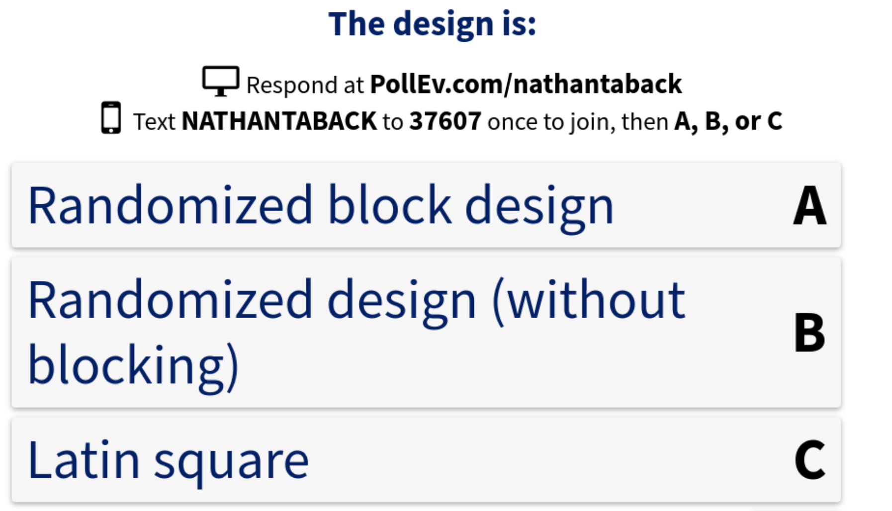

# Today's Class

+   Other Blocking Designs
    -   Latin Square
    -   Graeco Latin Square
    -   hypo-Graeco Latin Square
    -   Randomized incomplete block design
    
+   Assessing significance in unreplicated factorial designs
    -   Normal plots
    -   half-Normal plots
    -   Lenth's method

# Factorial Assignment

- Read the sample report.
- You are supposed to design an experiment using a factorial design.
- This means I want you to generate the data by running an experiment.  So finding data (e.g., on the web) is not appropriate. 
- What are the controllable input variables (factors) in your experiment? What is the response variable?  
- Example: How does coffee consumption and hours of sleep affect running speed?

# Randomized block designs 

- A group of homogeneous units is referred to as a block.
- Examples; days, weeks, batches, lots, and sets of twins. 
- For blocking to be effective units should be arranged so that the within-block variation is much smaller than the between block variation.


# Randomized block designs 

- Consider an experiment to compare sales from four different medical treatments for headache.
- The effectiveness of the four treatments is known to be different for different age groups.
- Therefore, block by age group.
- A randomized block design randomly assigns subjects in each block to the four treatments.
- Experimental Design Principle: "Block what you can and randomize what you cannot."


# Other blocking designs

* Latin square 

* Graeco-Latin squares, 

* Hyper-Graeco-Latin Squares, 

* Balanced incomplete block designs.

# The Latin Square Design

- There are several other types of designs that utilize the blocking principle such as The Latin Square design. 

- If there is more than one nuisance source that can be eliminated then a Latin Square design might be appropriate. 


# Latin Square Design - Automobile Emissions

- An experiment to test the feasibility of reducing air pollution.
- A gasoline mixture was modified by changing the amounts of certain chemicals.
- This produced four different types of gasoline: A, B, C, D
- These four treatments were tested with four different drivers and four different cars.

# Latin Square Design - Automobile Emissions

- Two blocking factors: cars and drivers.

- The Latin square design was used to help eliminate possible differences between drivers I, II, III, IV and cars 1, 2, 3, 4.

- Randomly allocate treatments, drivers , and cars.


  Driver     Car 1   Car 2   Car 3   Car 4   
----------- ------- ------- ------- -------                       
Driver I     A       B       D       C
Driver II    D       C       A       B
Driver III   B       D       C       A
Driver IV    C       A       B       D

# Latin Square Design - Automobile Emissions

- The data from the experiment.          
          
Driver       Car 1   Car 2   Car 3   Car 4   
----------- ------- ------- ------- -------                       
Driver I     A       B       D       C
             19      24      23      26
Driver II    D       C       A       B
             23      24      19      30
Driver III   B       D       C       A
             15      14      15      16
Driver IV    C       A       B       D
             19      18      19      16


# Latin Square Design - Automobile Emissions

```{r,cache=TRUE,echo=FALSE}
tab0408 <- read.csv("~/Dropbox/Docs/sta305/BHHData/BHH2-Data/tab0408.dat", sep="")
```

```{r,comment=""}
sapply(split(tab0408$y,tab0408$cars), mean)# car means 
sapply(split(tab0408$y,tab0408$driver), mean)# driver means 
sapply(split(tab0408$y,tab0408$additive), mean)# additive means
mean(tab0408$y) #grand mean
```


# Latin Square Design - Automobile Emissions

- Why not standardize the conditions and make the 16 experimental runs with a single car and single driver for the four treatments?
- Could also be valid but Latin square provides a wider inductive basis.

# Latin Square Design - Automobile Emissions

```{r,cache=TRUE,comment=""}
latinsq.auto <- lm(y~additive+as.factor(cars)+as.factor(driver),data=tab0408)
anova(latinsq.auto)
```

$$SS_T=SS_{cars}+SS_{drivers}+SS_{Additives}+SS_E$$

#  Automobile Emissions

If blocking variables are not used in calculating the ANOVA table.

```{r,cache=TRUE,comment=""}
latinsq.auto <- lm(y~additive,data=tab0408)
anova(latinsq.auto)
```

# Latin Square Design - Automobile Emissions

- Assuming that the residuals are independent and normally distributed and the null hypothesis that there are no treatment differences is true then the ratio of mean squares for treatments and residuals has an $F_{3,6}$ distribution.

- This analysis assumes that treatments, cars, and drivers are additive.

- If the design was replicated then this would increase the degrees of freedom for the residuals and reduce the mean square error.

# General Latin Square

- A Latin square for $p$ factors of a $p \times p$ Latin square, is a square containing $p$ rows and $p$ columns

- Each of the $p^2$ cells contains one of the $p$ letters that correspond to a treatment.

- Each letter occurs once and only once in each row and column.

- There are many possible $p \times p$ Latin squares.

# General Latin Square

Which of the following is a Latin square?

      Col1 Col2 Col3
----- ---- ---- ----
Row 1   B   A   C
Row 2   A   C   B
Row 3   C   B   A

      Col1 Col2 Col3
----- ---- ---- ----
Row 1   A   B   C
Row 2   C   A   B
Row 3   B   B   A

# Poll question

An industrial engineer is investigating the effect of four assembly methods (A, B, C, D) on the assembly time of a component.  Four operators are selected for the study.  The engineer also knows that each assembly method produces fatigue such that the time required for the last assembly might be greater than the time required for the first, regardless of method. The engineer randomly assigns the order that each operator uses the four methods: operator 1 uses the methods in the order: C, A, D, B

Operator      A      B           C         D
--------- --------- --------- --------- ---------
I            2        4        1          3   
II            4        2        3          1
III            2        1        4          3
IV            3        4        1          2  


{width=60%}


	

# Misuse of the Latin Square

- Inappropriate to use Latin square to study factors that can interact.
- Effects of one factor can then be mixed up with interactions of other factors.
- Outliers can occur as a result of these interactions.
- When interactions between factors are likely possible need to use a factorial design.

# Graeco-Latin Square

A Graeco-Latin square is a $k \times k$ pattern that permits study of $k$ treatments simultaneously with three different blocking variables each at $k$ levels.


           Car 1        Car 2        Car 3        Car 4   
---------- ------------ ----------- ----------- -----------           
Driver I   A $\alpha$   B $\beta$    C $\gamma$  D $\delta$
Driver II  B $\delta$   A $\gamma$   D $\beta$   C $\alpha$
Driver III  C $\beta$   D $\alpha$   A $\delta$  B $\gamma$
Driver IV  D $\gamma$   C $\delta$   B $\alpha$  A $\beta$

# Graeco-Latin Square


- This is a Latin square in which each Greek letter appears once and only once with each Latin letter.
- Can be used to control three sources of extraneous variability (i.e. block in three different directions).

           Car 1        Car 2        Car 3        Car 4   
---------- ------------ ----------- ----------- -----------           
Driver I   A $\alpha$   B $\beta$    C $\gamma$  D $\delta$
Driver II  B $\delta$   A $\gamma$   D $\beta$   C $\alpha$
Driver III  C $\beta$   D $\alpha$   A $\delta$  B $\gamma$
Driver IV  D $\gamma$   C $\delta$   B $\alpha$  A $\beta$

# Graeco-Latin Square

To generate a $3 \times 3$ Graeco-Latin square design, superimpose two designs using the Greek letters for the second $3 \times 3$ Latin square.

     Col1 Col2 Col3
---- ---- ---- ----
Row 1  B   A   C
Row 2  A   C   B
Row 3  C   B   A

     Col1 Col2 Col3
---- ---- ---- ----
Row 1  A   B   C
Row 2  C   A   B
Row 3  B   C   A


# hyper-Graeco-Latin Square

These three Latin squares can be superimposed to form a hyper-Graeco-Latin square.  
Can be used to control 4 nuisance factors (i.e. block 4 factors).

Row      Col1   Col2   Col3   Col4
------ ------ ------ ------ ------
Row 1   B      A      D      C
Row 2   C      D      A      B
Row 3   D      B      C      A
Row 4   A      C      B      D

 Row  Col1 Col2 Col3 Col4
----- ---- ---- ---- ----
Row 1  D   A    C    B
Row 2  A   D    B    C
Row 3  B   C    A    D
Row 4  C   B    D    A

 Row  Col1 Col2 Col3 Col4
----- ---- ---- ---- ----
Row 1  A   D    B    C
Row 2  C   A    D    B
Row 3  B   C    A    D
Row 4  D   B    C    A

# hyper-Graeco-Latin Square

- A machine used for testing the wear on types of cloth.
- Four pieces of cloth can be compared simultaneously on one machine.
- Response is weight loss in tenths of mg when rubbed against a standard grade of emery paper for 1000 revolutions of the machine.

# hyper-Graeco-Latin Square

- Specimens of 4 different cloths (A, B,C,D) are compared.
- The wearing qualities can be in any one of 4 positions $P_1,P_2,P_3,P_4$ on the machine.
- Each emery ($\alpha, \beta,\gamma, \delta$) paper used to cut into for quarters and each quarter used to complete a cycle $C_1, C_2,C_3,C_4$ of 1000 revolutions.
- Object was to compare treatments.

# hyper-Graeco-Latin Square

i) type of specimen holders 1, 2, 3, 4
ii) position on the machine $P_1,P_2,P_3,P_4$.
iii) emory paper sheet $\alpha,\beta,\gamma,\delta$.
iv) machine cycle $C_1,C_2,C_3,C_4$.

The design was replicated.  The first replicate is shown in the table below.

       $P_1$           $P_2$          $P_3$        $P_4$
----- -------------  ------------- -------------  ------------- 
$C_1$  A $\alpha$ 1  B $\beta$ 2   C $\gamma$ 3   D $\delta$ 4
         320           297            299           313
$C_2$  C $\beta$ 4   D $\alpha$ 3  A $\delta$ 2   B $\gamma$ 1
         266           227            260           240
$C_3$  D $\gamma$ 2  C $\delta$ 1  B $\alpha$ 4   A $\beta$ 3
         221           240            267           252
$C_4$  B $\delta$ 3  A $\gamma$ 4  D $\beta$ 1    C $\alpha$ 2
         301           238            243           290

# hyper-Graeco-Latin Square
```{r, echo=F,cache=TRUE,comment=""}
tab0412 <- read.csv("~/Dropbox/Docs/sta305/BHHData/BHH2-Data/tab0412.dat", sep="")
tab0412$rep[tab0412$cycle >= 1 & tab0412$cycle <= 4] <- 1
tab0412$rep[tab0412$cycle >= 5 & tab0412$cycle <= 8] <- 2
```

A linear model can be fit so that the ANOVA table and parameter treatment effects can be calculated.

```{r,comment=""}
wear.hypsq <- lm(y~treatment+as.factor(rep)+as.factor(position)+
                   as.factor(cycle)+as.factor(holder)+
                   as.factor(paper),data=tab0412)
anova(wear.hypsq)
```         

#Balanced incomplete block design

- Suppose that instead of four samples to be included on each 1000 revolution cycle only three could be included, but the experimenter still wanted to compare four treatments.
- The size of the block is now 3 - too small to accommodate all treatments simultaneously.

#Balanced incomplete block design


A balanced incomplete block design has the property that every pair of treatments occurs together in a block the same number of times. 


Cycle block |  |  |
------------|--|--|--
1           |A |B |C
2           |A |B |D
3           |A |C |D
4           |B |C |D

Cycle block |A |B |C | D
------------|--|--|--|--
1           |x |x |x | 
2           |x |x |  |x
3           |x |  |x |x
4           |  |x |x |x

# Back to Factorial Designs ...

How can significance be assessed in unreplicated factorial designs?

# Quantile-Quantile Plots

- Quantile-quantile (Q-Q) plots are useful for comparing distribution functions.  
- If $X$ is a continuous random variable with strictly increasing distribution function $F(x)$ then the $pth$ quantile of the distribution is the value of $x_p$ such that, $$F(x_p)=p$$ or $$x_p=F^{-1}(p).$$

- In a Q-Q plot, the quantiles of one distribution are plotted against another distribution.  
- Q-Q plots can be used to investigate if a set of numbers follows a certain distribution.  

# Quantile-Quantile Plots

- Suppose that we have observations independent observations $X_1,X_2, ...,X_n$ from a uniform distribution on $[0,1]$ or Unif[0,1]. 

- The ordered sample values (also called the order statistics) are the values $X_{(j)}$ such that 

$$X_{(1)}<X_{(2)}< \cdots < X_{(n)}$$. 

- It can be shown that 

$$E\left(X_{(j)}\right)=\frac{j}{n+1}.$$

- This suggests that if we plot 

$$X_{(j)} \hspace{0.2cm} {\text{vs. }} \hspace{0.2cm} \frac{j}{n+1}$$ 

then if the underlying distribution is Unif[0,1] then the plot should be rooughly linear.

# Quantile-Quantile Plots

- A continuous random variable with strictly increasing CDF $F_X$ can be transformed to a Unif[0,1] by defining a new random variable $Y=F_X(X)$.  

- Suppose that it's hypothesized that $X$ follows a certain distribution function with CDF $F$.  
- Given a sample $X_1,X_2,...,X_n$ plot 
$$F(X_{(k)}) \hspace{0.2cm} {\text{vs. }} \hspace{0.2cm} \frac{k}{n+1}$$ 

or equivalently $$X_{(k)} \hspace{0.2cm} {\text{vs. }} \hspace{0.2cm} F^{-1}\left(\frac{k}{n+1}\right)$$

- $X_{(k)}$ can be thought of as empirical quantiles and $F^{-1}\left(\frac{k}{n+1}\right)$ as the hypothesized quantiles.

- The quantile assigned to $X_{(k)}$ is not unique.  
- Instead of assigning it $\frac{k}{n+1}$ it is often assigned $\frac{k-0.5}{n}$.  In practice it makes little difference which definition is used.


# Normal Quantile-Quantile Plots

The cumulative distribution function (CDF) of the normal has an S-shape.

```{r}
x <- seq(-4,4,by=0.1)
plot(x,pnorm(x),type="l")
```


# Normal Quantile-Quantile Plots

The normality of a set of data can be assessed by the following method.

- Let $r_{(1)}<...<r_{(N)}$ denote the ordered values of $r_1,...,r_N$.  
- A test of normality for a set of data is to plot the ordered values $r_{(i)}$ of the data versus $p_i=(i-0.5)/N$.  
- If the plot has the same S-shape as the normal CDF then this is evidence that the data come from a normal distribution.


# Normal Quantile-Quantile Plots

- A plot of $r_{(i)}$ vs. $p_i=(i-0.5)/N, i=1,...,N$ for a random sample of 1000 simulated from a $N(0,1)$.

```{r}
N <- 1000;x <- rnorm(N);p <- ((1:N)-0.5)/N
plot(sort(x),p)
```


# Normal Quantile-Quantile Plots


- It can be shown that $\Phi(r_i)$ has a uniform distribution on $[0,1]$.  
- This implies that $E(\Phi(r_{(i)}))=i/(N+1)$ (this is the expected value of the $jth$ order statistic from a uniform distribution over $[0,1]$.  
- This implies that the $N$ points $(p_i,\Phi(r_{(i)}))$ should fall on a straight line.  
- Now apply the $\Phi^{-1}$ transformation to the horizontal and vertical scales. The $N$ points $$\left(\Phi^{-1}(p_i), r_{(i)} \right),$$ form the normal probability plot of $r_1,...,r_N$.  
- If $r_1,...,r_N$ are generated from a normal distribution then a plot of the points $\left(\Phi^{-1}(p_i), r_{(i)} \right), i=1,...,N$ should be a straight line.

# Normal Quantile-Quantile Plots

In R `qnorm()` is $\Phi^{-1}$.  

```{r, cache=TRUE}
set.seed(2503)
N <- 1000
x <- rnorm(N)
p <- (1:N)/(N+1)
plot(qnorm(p),sort(x))
```

# Normal Quantile-Quantile Plots

We usually use the built in function `qqnorm()` (and `qqline()` to add a straight line for comparison) to generate normal Q-Q plots.  Note that R uses a slightly more general version of quantile ($p_i=(1-a)/(N+(1-a)-a)$, where $a=3/8$, if $N \le 10$, $a=1/2$, if $N > 10$.

```{r}
qqnorm(x);qqline(x)
```


# Normal Quantile-Quantile Plots

A marked (systematic) deviation of the plot from the straight line would indicate that:

1. The normality assumption does not hold. 
2. The variance is not constant.

# Normal Quantile-Quantile Plots


```{r,cache=TRUE}
x <- runif(1000)
hist(x,main = "Sample from uniform")
```


# Normal Quantile-Quantile Plots


```{r}
qqnorm(x,main = "Sample from uniform");qqline(x)
```


# Normal Quantile-Quantile Plots


```{r,cache=TRUE}
x1 <- rnorm(100,mean = 0,sd = 1);x2 <- rnorm(100,mean = 0,sd = 5)
x3 <- rnorm(100,mean = 0,sd = 8); x <- c(x1,x2,x3)
hist(x,main = "Sample from three normals")
```


# Normal Quantile-Quantile Plots


```{r}
qqnorm(x);qqline(x)
```


# Normal plots in factorial experiments

- A major application is in factorial designs where the $r(i)$ are replaced by ordered factorial effects.
- Let $\hat {\theta}_{(1)} < \hat {\theta}_{(2)} < \cdots < \hat {\theta}_{(N)}$ be $N$ ordered factorial estimates. 

- If we plot $$\hat {\theta}_{(i)} \thinspace {\text vs. } \thinspace \Phi^{-1}(p_i). \thinspace i=1,...,N.$$ then factorial effects $\hat {\theta_{i}}$ that are close to 0 will fall along a straight line. Therefore, points that fall off the straight line will be declared significant.


# Normal plots in factorial experiments

The rationale is as follows:

1.  Assume that the estimated effects $\hat {\theta_{i}}$ are $N(\theta, \sigma)$ (estimated effects involve averaging of N observations and CLT ensures averages are nearly normal for N as small as 8).

2.  If $H_0: \theta_i=0, \thinspace i=1,...,N$ is true then all the estimated effects will be zero.

3.  The resulting normal probability plot of the estimated effects will be a straight line.

4.  Therefore, the normal probability plot is testing whether all of the estimated effects have the same distribution (i.e. same means).

-  When some of the effects are nonzero the corresponding estimated effects will tend to be larger and fall off the straight line.

# Normal plots in factorial experiments

Positive effects fall above the line and negative effects fall below the line.

```{r}
set.seed(10);x1 <- rnorm(10,0,1); x2 <- rnorm(5,10,1);x3 <- rnorm(5,-10,1)
x <- c(x1,x2,x3);qqnorm(x);qqline(x)
```

# Example - $2^3$ design for studying a chemical reaction

A process development experiment studied four factors in a $2^4$ factorial design. 

-  amount of catalyst charge **1**, 
-  temperature **2**, 
-  pressure **3**, 
-  concentration of one of the reactants **4**.  
-  The response $y$ is the percent conversion at each of the 16 run conditions. The design is shown below. 

# Example - $2^4$ design for studying a chemical reaction

```{r,cache=TRUE,echo=FALSE}
tab0510a <- read.csv("~/Dropbox/Docs/sta305/BHHData/BHH2-Data/tab0510a.dat", sep="")
knitr::kable(tab0510a[,2:6])

```

The design is not replicated so it's not possible to estimate the standard errors of the factorial effects.  

# Example - $2^4$ design for studying a chemical reaction

```{r,message=FALSE,comment=""}
fact1 <- lm(conversion~x1*x2*x3*x4,data=tab0510a)
round(2*fact1$coefficients,2)
```

# Example - $2^4$ design for studying a chemical reaction

A normal plot of the factorial effects is obtained by using the function `DanielPlot()` in the `FrF2` library.

```{r,message=FALSE, warning=FALSE}
library(FrF2)
DanielPlot(fact1, autolab=F,main="Normal plot of effects from process development study")
```


# Example 1

Which effects are not explained by chance?

```{r,echo=FALSE,message=FALSE,cache=TRUE}
set.seed(10)
library(FrF2)
x <- FrF2(nruns = 8,nfactors = 3)
A<-x$A;B<-x$B;C<-x$C
y <- rnorm(8,0,5)
dat <- data.frame(y,A,B,C)
mod1 <- lm(y~A*B*C,data=dat)
summary(mod1)
```


# Example 1

Which effects are not explained by chance according to the normal plot?

```{r}
FrF2::DanielPlot(mod1,code=TRUE,autolab=F,datax=F)
```


# Example 1 

```{r,echo=FALSE}
qqnorm(2*mod1$coefficients);qqline(2*mod1$coefficients)
```


# Example 2

Which effects are not explained by chance?

```{r,echo=FALSE,message=FALSE,cache=TRUE}
library(FrF2)
x <- FrF2(nruns = 8,nfactors = 3)
A<-x$A;B<-x$B;C<-x$C
y <- c(10,0.2,-0.3,5,3,0.2,0.4,-0.3)
dat <- data.frame(y,A,B,C)
mod1 <- lm(y~A*B*C,data=dat)
summary(mod1)
```


# Example 2

Which effects are not explained by chance according to the normal plot?

```{r,echo=FALSE,message=FALSE,cache=TRUE}
set.seed(10)
library(FrF2)
x <- FrF2(nruns = 8,nfactors = 3)
A<-x$A;B<-x$B;C<-x$C
y <- c(10,0.2,-0.3,5,3,0.2,0.4,-0.3)
dat <- data.frame(y,A,B,C)
mod1 <- lm(y~A*B*C,data=dat)
FrF2::DanielPlot(mod1,code = TRUE,autolab=F,datax=F)
```


# Example 2

```{r,echo=FALSE}
qqnorm(2*mod1$coefficients);qqline(2*mod1$coefficients)
```


# Half-Normal Plots

- A related graphical method is called the half-normal probability plot. 
- Let  $$\left|\hat{\theta}\right|_{(1)} < \left|\hat{\theta}\right|_{(2)} < \cdots < \left|\hat{\theta}\right|_{(N)}.$$ denote the ordered values of the unsigned factorial effect estimates.
- Plot them against the coordinates based on the half-normal distribution - the absolute value of a normal random variable has a half-normal distribution.
- The half-normal probability plot consists of the points $$\left|\hat{\theta}\right|_{(i)} \thinspace {\text vs. } \thinspace \Phi^{-1}(0.5+0.5[i-0.5]/N). \thinspace i=1,...,N.$$

# Half-Normal Plots

- An advantage of this plot is that all the large estimated effects appear in the upper right hand corner and fall above the line.
- The half-normal plot for the effects in the process development example is can be obtained with `DanielPlot()` with the option `half=TRUE`.


# Half-Normal Plots - $2^4$ design for studying a chemical reaction


```{r,message=FALSE}
library(FrF2)
DanielPlot(fact1,half=TRUE,autolab=F, 
           main="Normal plot of effects from process development study")
```


# Half-Normal Plots - $2^4$ design for studying a chemical reaction

Compare with full Normal plot.

```{r,message=FALSE}
library(FrF2)
DanielPlot(fact1,half=F,autolab=F, 
           main="Normal plot of effects from process development study")
```

