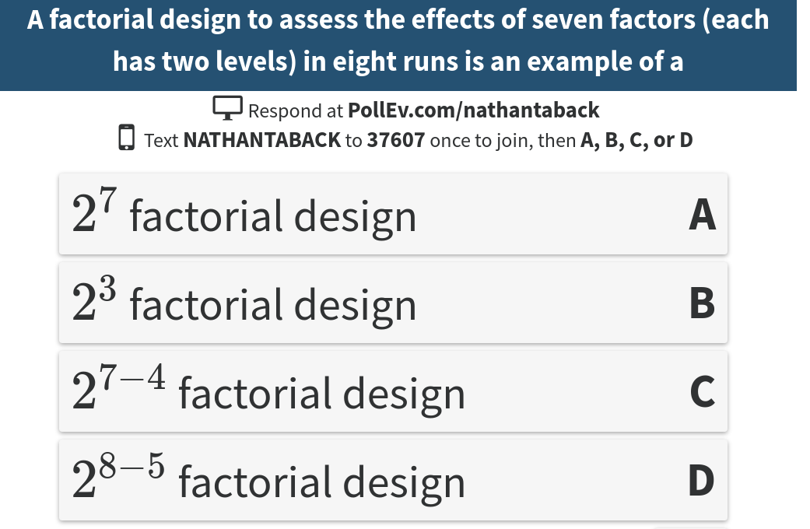

# Today's Class


- Fractional factorial design

# Exam review session


\begin{wrapfigure}{R}{0.5\textwidth}
  \begin{center}
    \includegraphics[width=0.40\textwidth]{examjam.jpg}
  \end{center}
\end{wrapfigure}


**Date:**    Thursday, April 6th  
---------------
**Time:**    10 am - 11 am
---------------
**Location:**    SS 2118
---------------
Stop by the SS lobby to take a few photos in the Photobooth, enjoy some free coffee and snacks and engage in other fun activities (lobby activities run 11-3).

```{r global_options, include=FALSE}
knitr::opts_chunk$set(cache.lazy = FALSE)
```

# Fractional factorial designs

- A $2^k$ full factorial requires $2^k$ runs.  
- Full factorials are seldom used in practice for large k (k>=7).  
- For economic reasons fractional factorial designs, which consist of a fraction of full factorial designs are used.  

# Example - Effect of five factors on six properties of film in eight runs

Five factors were studied in 8 runs (Box, Hunter, and Hunter (2005)).  The factors were:

(@)  Catalyst concentration (A)
(@)  Amount of additive (B)
(@)  Amounts of three emulsifiers (C, D, E)

Polymer solutions were prepared and spread as a film on a microscope slide.  Six different responses were recorded.

```{r,echo=FALSE,cache=TRUE}
tab0601 <- read.csv("~/Dropbox/Docs/sta305/BHHData/BHH2-Data/tab0601.dat", sep="")
```

```{r,echo=FALSE}
knitr::kable(tab0601)
```

# Example - Effect of five factors on six properties of film in eight runs

-  The eight run design was constructed beginning with a standard table of signs for a $2^3$ design in the factors A, B, C.

-  The column of signs associated with the BC interaction was used to accommodate factor D, the ABC interaction column was used for factor E.

-  A full factorial for the five factors A, B, C, D, E would have needed $2^5=32$ runs.

- Only 1/4 were run. This design is called a quarter fraction of the full $2^5$ or a $2^{5-2}$ design (a two to the five minus two design). 

- In general a $2^{k-p}$ design is a $\frac{1}{2^p}$ fraction of a $2^k$ design using $2^{k-p}$ runs. This design can study $k$ factors in $\frac{1}{2^p}$ fraction of the runs.

# Effect Aliasing and Design Resolution

- A chemist in an industrial development lab was trying to formulate a household liquid product using a new process. 
- The liquid had good properties but was unstable.  
- The chemist wanted to synthesize the product in hope of hitting conditions that would give stability, but without success.  
- The chemist identified four important influences: A (acid concentration), B (catalyst concentration), C (temperature), D (monomer concentration).  

# Effect Aliasing and Design Resolution

- His 8 run fractional factorial design is shown below.

```{r,echo=FALSE}
tab0602 <- read.csv("~/Dropbox/Docs/sta305/BHHData/BHH2-Data/tab0602.dat", sep="")
```

```{r,echo=FALSE}
knitr::kable(tab0602)
```

- The signs of the ABC interaction is used to accommodate factor D.  The tests were run in random order.  He wanted to achieve a stability value of at least 25.  

# Effect Aliasing and Design Resolution


```{r,comment="",cache=TRUE,message=FALSE,echo=TRUE,comment=""}
fact.prod <- lm(y~A*B*C*D,data=tab0602)
fact.prod1 <- aov(y~A*B*C*D,data=tab0602)
round(2*fact.prod$coefficients,2)
```

Even though the stability never reached the desired level of 25, two important factors, A and B, were identified. 


# Effect Aliasing and Design Resolution

```{r}
BsMD::DanielPlot(fact.prod,half = T)
```


# Effect Aliasing and Design Resolution

```{r}
BsMD::LenthPlot(fact.prod1)
```

# Poll Question 



# Effect Aliasing and Design Resolution

What information could have been obtained if a full $2^5$ design had been used?

Factors  Number of effects
------- -------------------
Main        5
2-factor    10
3-factor    10
4-factor    5
5-factor    1

- 31 degrees of freedom in a 32 run design.
- 16 used for estimating three factor interactions or higher.  
- Is it practical to commit half the degrees of freedom to estimate such effects?  
- According to effect hierarchy principle three-factor and higher not usually important.  
- Thus, using full factorial wasteful.  It's more economical to use a fraction of full factorial design that allows lower order effects to be estimated.

# Effect Aliasing and Design Resolution

Consider a design that studies five factors in 16 run.  A half fraction of a $2^5$ or $2^{5-1}$.

```{r,comment="",echo=FALSE}
B <- rep(c(-1,1),8)
C <- rep(c(1,1,-1,-1),4)
D <- rep(c(rep(1,4),rep(-1,4)),2)
E <- B*C*D
Q <- c(rep(-1,8),rep(1,8))
run <- 1:16
factnames <- c("Run","B","C","D","E","Q")
knitr::kable(cbind(run,B,C,D,E,Q),col.names = factnames)
```

- The factor E is assigned to the column BCD.  
- The column for E is used to estimate the main effect of E and also for BCD.  
- The main factor E is said to be **aliased** with the BCD interaction.

# Effect Aliasing and Design Resolution

- This aliasing relation is denoted by
$$E=BCD \text{ or } I=BCDE,$$
where $I$ denotes the column of all +’s.

- This uses same mathematical definition as the confounding of a block effect with a factorial effect.  
- Aliasing of the effects is a price one must pay for choosing a smaller design. 

- The $2^{5-1}$ design has only 15 degrees of freedom for estimating factorial effects, it cannot estimate all 31 factorial effects among the factors B, C, D, E, Q.

# Effect Aliasing and Design Resolution

- The equation $I=BCDE$ is called the **defining relation** of the $2^{5-1}$ design.
- The design is said to have resolution IV because the defining relation consists of the “word” BCDE, which has “length” 4.
- Multiplying both sides of $I=BCDE$ by column B
$$B=B \times I=B \times BCDE=CDE,$$
the relation $B=CDE$ is obtained.  
- B is aliased with the CDE interaction.  Following the same method all 15 aliasing relations can be obtained.

# Effect Aliasing and Design Resolution

- To get the most desirable alias patterns, fractional factorial designs of highest resolution would usually be employed.
- There are important exceptions to this rule that we will not cover in the course.

# Class Question

Consider a $2^{5-1}$ fractional factorial design.

(a) How many factors does this design have?
(b) How many runs are involved in this design?
(c) How many levels for each factor?
(d) The factor $E$ is assigned to the four-way interaction ($ABCD$). What is the defining relation? What is the design resolution? What are the aliasing relations?


# Example - Leaf spring experiment

An experiment to improve a heat treatment process on truck leaf springs (Wu and Hamada (2009)).  The height of the unloaded spring is an important quality characteristic.  

\begin{figure}[h]
\includegraphics[width=4.5cm]{leafspring.jpg}
\includegraphics[width=4.5cm]{Spring_Measurement.jpg}
\end{figure}


# Example - Leaf spring experiment

Five factors that might affect height were studied in this $2^{5-1}$ design.

Factor                          Level
-------------------------    -------------------------
B. Temperature                1840 (-), 1880 (+)
C. Heating time               23 (-), 25 (+)
D. Transfer time              10 (-), 12 (+)
E. Hold down time             2 (-), 3 (+)
Q. Quench oil temperature     130-150 (-), 150-170 (+)

# Example - Leaf spring experiment


```{r,cache=TRUE,echo=FALSE}
leafspring <- read.csv("~/Dropbox/Docs/sta305/2016/classnotes/week10/leafspring.dat", sep="")
knitr::kable(leafspring)
```

# Example - Leaf spring experiment

The factorial effects are estimated as before.

```{r,cache=TRUE,comment=""}
fact.leaf <- lm(y~B*C*D*E*Q,data=leafspring)
fact.leaf2 <- aov(y~B*C*D*E*Q,data=leafspring)
round(2*fact.leaf$coefficients,2)
```


# Example - Leaf spring experiment

```{r,comment=""}
BsMD::DanielPlot(fact.leaf,half = T)
```


# Example - Leaf spring experiment

```{r,comment=""}
BsMD::LenthPlot(fact.leaf2,cex.fac = 0.8)
```

