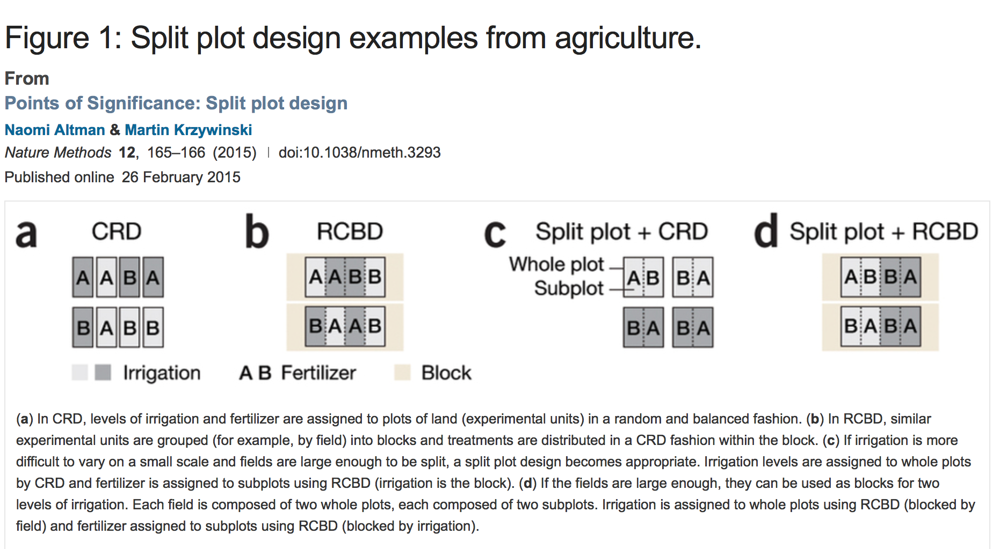

# Today's Class
    
+   Split plot designs
    
    * Corrosion study example
    * Split plot versus factorial designs
    * Why choose a plit plot design?
    * ANOVA for split plot designs
    * How not to do it
    * How to do it
    * Randomizing a split plot design

# Split plot designs

- These designs were originally developed for agriculture by R.A. Fisher and F. Yates.
- Due to their applicability outside agriculture they could be called split-unit designs.
- But we will use split-plot ...

# Split plot designs

- Some factors need to be applied to larger plots compared to other factors.
- For example, if type of irrigation method and the type of fertilizer used are the two factors then irrigation requires a larger plot.
- Apply a specific irrigation method to a large plot, and fertilizer to a smaller plot.

# Split plot designs



[Points of Significance: Split plot design. Nature Methods 12, 165–166 (2015)](http://rdcu.be/g9Lw)


# Split plot designs - corrosion study

- An experiment of corrosion resistance of steel bars treated with four different coatings $C_1, C_2, C_3, C_4$ was conducted.
- Three furnace temperatures were investigated and four differently coated bars randomly arranged in the furnace within each heat.
- Positions of the coated steel bars in the furnace randomized within each heat. 
- Furnace temperature was difficult to change so heats were run in systematic order shown.
                               
              
Temperature   | Position 1  | Position 2 | Position 3 | Position 4 |
--------------|--------|-------|-------|-------|
$360^{\circ}$ |        |       |       |       |
$370^{\circ}$ |        |       |       |       |
$380^{\circ}$ |        |       |       |       |
$380^{\circ}$ |        |       |       |       |
$370^{\circ}$ |        |       |       |       |
$360^{\circ}$ |        |       |       |       |

# Split plot designs - corrosion study


The split-plot experiment of corrosion resistance is shown for the first replicate at 360. 


# Split plot designs - corrosion study

- There are $I=3$ furnace temperatures arranged in $n=2$ replications.
- Each furnace temperature is called a **whole plot**.
- The whole plot treatments are $T_1=360^{\circ},T_2=370^{\circ},T_3=380^{\circ}$.
- Within each furnace temperature there are $J=4$ subplots.
- The four sub plot treatments $C_1, C_2, C_3, C_4$ are randomly applied to the sub plots within each whole plot.

Temperature   | Position 1  | Position 2 | Position 3 | Position 4 |
--------------|--------|-------|-------|-------|
$360^{\circ}$ |  $C_2$ | $C_3$ | $C_1$ |$C_4$  |       |
$370^{\circ}$ |   $C_1$ | $C_3$ | $C_4$ |$C_2$  |       |
$380^{\circ}$ | $C_3$ | $C_1$ | $C_2$ |$C_4$  |       |


Temperature   | Position 1  | Position 2 | Position 3 | Position 4 |
--------------|--------|-------|-------|-------|
$380^{\circ}$ | $C_4$ | $C_3$ | $C_2$ |$C_1$  |       |
$370^{\circ}$ | $C_4$ | $C_1$ | $C_3$ |$C_2$  |       |
$360^{\circ}$ | $C_1$ | $C_4$ | $C_2$ |$C_3$  |       |

# Split plot designs - corrosion study

Analysis of the whole plots.


Source              df
-------------       -----
Replications        $2-1$
Temperature         $3-1$
Whole plot Error    $(3-1)(2-1)$
Between whole plots $3 \cdot 2 -1$


# Split plot designs - corrosion study

Analysis of the sub plots.


Source                                                     df
--------------------------------------------------         -----
Between whole plots                                        $3\cdot 2-1$
Coatings                                                   $4-1$
Coatings $\times$ Temperature                              $(4-1)(3-1)$
Sub plot Error                                             $3(2-1)(4-1)$
Total                                                      $3\cdot 2 \cdot 4 -1$


# Split plot designs - corrosion study

The primary interest were the comparison of coatings and how they interacted with temperature.

Some of the data from the experiment is shown below.

```{r,echo=FALSE,message=FALSE,cache=TRUE}
library(dplyr)
tab0901 <- read.csv("~/Dropbox/Docs/sta305/BHHData/BHH2-Data/tab0901.dat", sep="")
tab0901$position <- rep(1:4,6)
tab0901$replication <- c(rep(1,12),rep(2,12)) 
```


```{r,echo=FALSE}
knitr::kable(head(tab0901[c(1,2,3,5,6,4)]))
```


# Split-plot designs versus Factorial Designs

- How does the split-plot design compare with a 3x4 factorial design of coating and temperature? 
- In the factorial design an oven temperature-coating combination would be randomly  selected then we would obtain a corrosion resistance measure. 
- Then randomly select another oven temperature-coating combination and obtain another corrosion resistance measure until we have a resistance measure for all 12 oven temperature-coating combinations.  
- To run each combination in random order would require adjusting the furnace temperature up to 24 times (since there were two replicates) and would have resulted in a much larger variance.  
- The split plot is like a randomized block design (with replications as blocks) in which the opportunity is taken to introduce additional factors between blocks. 
- In this design there is only one source of error influencing the resistance.

# Split-plot designs versus Factorial Designs

There are two different experimental units: 

- The six different furnace heats, called whole plots. 
- The four positions within each furnace heat, called subplots, where the differently coated bars could be placed in the furnace. 
- Misleading to treat as if only one error source and one variance.
- Two different experimental units: six furnace heats (whole plots); and four positions (subplots) where differently coated bars placed in furnace.
- Two different variances: $\sigma^2_W$ for whole plots and $\sigma^2_S$ for subplots. 
- It would be misleading to treat as if only one error source and one variance.

# Split plot designs versus Factorial Designs

- Achieving and maintaining a given temperature in this furnace was very imprecise.  
- The whole plot variance, measuring variation from one heat to another, was expected to be large.  
- The subplot variance measuring variation from position to position, within a given heat, was expected to be small. 
- The subplot effects and subplot-main plot interaction are estimated using with the same subplot error.

# Why choose a split plot design?

- Two considerations important in choosing an experimental design are feasibility and efficiency. 
- In industrial experimentation a split-plot design is often convenient and the only practical possibility. 
- This is the case whenever there are certain factors that are *difficult to change* and others that are *easy to change*. 
- In this example changing the *furnace temperature was difficult to change*; rearranging the *positions of the coated bars in the furnace was easy to change*.   


# Question

\begin{wrapfigure}{r}{0.5\textwidth}
  \begin{center}
    \includegraphics[width=0.48\textwidth]{question.png}
  \end{center}
\end{wrapfigure}


A large-scale bakery is designing a new brownie recipe. They are experimenting with two levels of chocolate and sugar using two different baking temperatures. In the experiment four trays of brownies will baked, and each tray will have one of the chocolate/sugar combinations.  However, to save time they decide to bake four trays of brownies at the same time instead of baking each tray individually. A statistician recommends a split plot design.  


# ANOVA table for split plot experiment

- The numerical calculations for the ANOVA of a split-plot design are the same as for other balanced designs (designs where all treatment combinations have the same number of observations) and can be performed in R or with other statistical software. 
- Experimenters sometimes have difficulty identifying appropriate error terms.


```{r,comment=""}
spfurcoat1 <- aov(resistance~ replication*heats*coating,data=tab0901)
summary(spfurcoat1)
```

# ANOVA table for split plot experiment - whole plot

```{r,comment=""}
spfurcoat1 <- aov(resistance~ replication*heats*coating,data=tab0901)
summary(spfurcoat1)
```


The ANOVA table for the whole plots is:


Source                                     DF   SS    MS
------------------------------------       --   ---   ---
`replication`                               1   782   782
`heats`                                     2   26519 13260
`replication:heats` (whole plot error)      2   13658 6829

The whole plot mean square error is 6829.  This measures the differences between the replicated heats at the three different temperatures.

# ANOVA table for split plot experiment - sub plot

```{r,comment="",strip.white=TRUE }
spfurcoat1 <- aov(resistance~ replication*heats*coating,data=tab0901)
summary(spfurcoat1)
```

The subplot effects are:

Source                         DF   SS    MS
----------------------------   --   ---   ---
`coating`                       3   4289  1430
`heats:coating`                 6   3270  545
Sub plot error                  9   1121  124.6            


- The subplot mean square error is $(254+867)/(3+6)=$ `r round((254+867)/(3+6),1)`.  
- The subplot error measures to what extent the coatings give dissimilar results within each of the replicated temperatures. 

# ANOVA table for split plot experiment - using `aov()` with `Error()`

In R the ANOVA table for whole plot and sub plot effects can obtained by specifying the subplot error structure explicit using `Error()`.

```{r,comment=""}
spfurcoat <- aov(resistance~ replication + heats + replication:heats 
                 + coating + heats:coating 
                 +Error(heats/replication),data=tab0901)
summary(spfurcoat)
```


# ANOVA for split plot experiment - using `aov()` with `Error()`- whole plot

The headings `Error: heats` and `Error: heats:replication` contain the ANOVA for a randomized block design with replicates as blocks.


```{r,comment=""}
summary( aov(resistance~heats*replication,tab0901))
```

**Caution:** The p-value for `heats` is incorrect in this output!

# ANOVA for split plot experiment - using `aov()` with `Error()`- whole plot


- The ratio of mean square errors follows an $F_{2,2}$. 
- The F statistic for whole plots is 13260/6829= `r round(13260/6829,2)`.  
- The p-value of the test $$H_0:\mu_{360}=\mu_{370}=\mu_{380}$$  

```{r,comment=""}
1-pf(q = 13260/6829,df1 = 2,df2 = 2)
```

**This is the correct p-value for** `heats`.

# ANOVA for split plot experiment - using `aov()` with `Error()`- sub plot

- The subplot effects of coating and the interaction of temperature and coating can be tested by forming F statistics using the subplot mean square error.  
- These tests are given in the ANOVA table under the heading `Error: Within`.  
- There are statistically significant differences between coatings and the interaction between temperature and coating.  


# ANOVA for split plot experiment 

The values for the split plot experiment can be put into one ANOVA table.


Source                         DF   SS    MS      F                P
----------------------------   --   ---   ---    ------------    -----
**Whole plot:**
replication                     1   782   782    782/6829=0.12    0.77
heats                           2   26519 13260  13260/6829=1.9   0.34
replication $\times$ heats      2   13658 6829
(whole plot error)
**Subplot:**
coating                         3   4289  1430   11.48            0.002
coating $\times$ heats          6   3270  545    4.376            0.02
Subplot error                   9   1121  124.5


# Estimating whole plot and sub plot variances

- The whole plot error mean square 6829 is an estimate of $$4\sigma^2_W+\sigma^2_S$$.

$$6829=4\hat {\sigma}^2_W+\hat {\sigma}^2_S.$$

- The subplot mean square error is 125 so $\hat {\sigma}^2_S=125$.  Estimates of the whole plot and sub plot standard deviations are,

$$ \hat {\sigma}_W =\sqrt{\left(\frac{6829-125}{4} \right)}=40.9, \hspace{1cm} \hat {\sigma}_S=\sqrt{125}=11.1.$$

- The estimated standard deviation of furnace heats is approximately four times as large as the standard deviation for coatings.

# ANOVA for split plot experiment 

- Suppose that a split plot experiment is conducted with whole factor plot $A$ with $I$ levels and sub plot factor $B$ with $J$ levels.  
- The experiment is replicated $n$ times.  

Source                         DF           SS    
----------------------------  ----------   -------------
**Whole plot:**
replication                   $n-1$         $SS_{Rep}$
A                             $I-1$         $SS_A$
replication $\times$ A        $(n-1)(I-1)$  $SS_{W}$
(whole plot error)
**Subplot:**
B                             $J-1$         $SS_B$
$A \times B$                  $(I-1)(J-1)$  $SS_{A \times B}$
Subplot error                 $I(J-1)(n-1)$ $SS_S$

# Split plot ANOVA - how not to do it

- Suppose that you didn’t know about the split-plot structure. 
- So the experimenter analyzes the data as a two-way ANOVA.  
- Would you reach the same conclusions?

# Split plot ANOVA - how not to do it

```{r,comment=""}
furcoatanova <- aov(resistance~heats*coating,data=tab0901)
summary(furcoatanova)
```

The two-way ANOVA shows that there is no evidence of a difference in the four coatings, evidence of a difference between temperatures, and no evidence of an interaction between temperature and coating.

# Split plot ANOVA - how not to do it

What happened?

- The two factors temperature and coating use different randomization schemes and the number of replicates is different for each factor. 
- The subplot factor, coatings, restricted randomization to the four positions within a given temperature (whole plot). 
- For the whole plot factor, complete randomization can usually be applied in assigning the levels of A to the whole plots (although this was not the case for the corrosion study).  
- Therefore, the error should consist of two parts: whole plot error and subplot error.  
- In order to test the significance of the whole plot factor and the subplot factor we need respective mean squares with the respective whole plot error component and subplot error component respectively. 


# Split plot ANOVA - how not to do it

The (incorrect) two-way ANOVA model is 

$$y_{ijk}=\eta+\alpha_i+\beta_j+(\alpha\beta)_{ij}+\epsilon_{ijk}, \thinspace \epsilon_{ijk} \sim N(0,\sigma^2)$$

$y_{ijk}$ is the observation for the $k$th replicate of the $i$th level of factor $A$ and the $j$th level of factor $B$. (adapted from Wu and Hamada)


# Split plot ANOVA - how to do it

The correct model is

$$y_{ijk}=\eta+\tau_k+ \alpha_i+ (\tau\alpha)_{ki}+ \beta_j+(\alpha\beta)_{ij}+(\tau\beta)_{kj}+(\tau\alpha\beta)_{kij}+ \epsilon^{\prime}_{ijk}, \thinspace \epsilon^{\prime}_{ijk} \sim N(0,\sigma^2)$$

$i=1,...,I; \thinspace j=1,...,J; \thinspace k=1,...,n.$

$y_{ijk}$ is the observation for the $k$th replicate of the $i$th level of factor $A$ and the $j$th level of factor $B$. 

*Whole plot effects*

- $\tau_k$ is the effect of the $k$th replicate.

- $\alpha_i$ is the $i$th main effect for $A$

- $(\tau\alpha)_{ki}$ is the $(k,i)$th interaction effect between replicate and $A$.  This is the whole plot error term.

*Subplot effects*

- $\beta_j$ is the $j$th main effect of $B$

- $(\alpha\beta)_{ij}$ is the $(i,j)$th interaction between $A$ and $B$.

- $(\tau\beta)_{kj}$ is the $(k,j)$th interaction between the replicate and $B$.

- $(\tau\alpha\beta)_{kij}$ is the $(k,i,j)$th interaction between the replicate, $A$, and $B$.

- $\epsilon^{\prime}_{ijk}$ is the error term.

The term $\epsilon_{kij}=(\tau\beta)_{kj}+(\tau\alpha\beta)_{kij}+\epsilon^{\prime}_{ijk}$  is the subplot error term.  


# What is a split plot?

- A split-plot can be thought of as a blocked experiment where the blocks themselves serve as experimental units for a subset of the factors.
- Corresponding to two levels of experimental units are two levels of randomization.  
- One randomization to to determine assignment to whole plots.  
- A randomization of treatments to split-plot experimental units occurs within each plot. 

# Randomizing a split plot experiment

The three steps in randomizing a basic split-plot experiment consisting of 5 blocks (replicates), 4 levels of whole plot factor A, and 8 levels of split-plot factor B are:

1. Division of experimental area or material into five blocks 


# Randomizing a split plot experiment

2. Randomization of four levels of whole plot factor A to each of the five blocks. 


# Randomizing a split plot experiment

3. Randomization of eight levels of split plot factor B within each level of whole plot factor A.


# THE LAST SLIDE OF THE COURSE (well almost ...)


\center \Huge{Thanks for being a great class! \\}

\bigskip

\Large{p.s - don't forget about the exam review session \\ Monday, April 11, 11:00-12:00}

