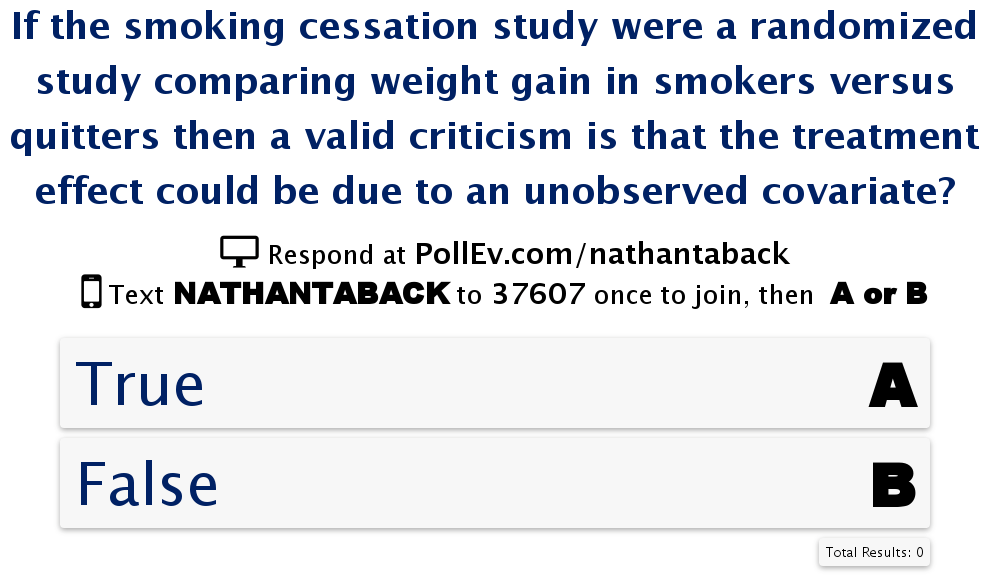

#Today's class

- Estimating the propensity score
- The balancing property of the propensity score
- Assessing balance
- Ignorable treatment assignment and the propensity score
- Three methods that use the propensity score to reduce bias: matching; stratification; and regression adjustment


# The propensity score

- Covariates are pre-treatment variables and take the same value for each unit no matter which treatment is applied.  
- For example, pre-treatment blood pressure or pre-test reading level are not influenced by a treatment that would alter blood pressure or reading level.  

The propensity score is $$e({\bf x})=P\left(T=1|{\bf x}\right),$$ where ${\bf x}$ are observed covariates.

The $i^{th}$ propensity score is the probability that a unit receives treatment given all the information, recorded as covariates, that is observed before the treatment.

# The propensity score

In experiments the propensity scores are known.  In observational studies they can be estimated using models such as logistic regression where the outcome is the treatment indicator and the predictors are all the confounding covariates.


# The propensity score

- Consider a study that plans to use a doctor's medical records to compare two treatments ($T=0$ and $T=1$) given for a certain condition.  
- Treatments were not assigned to patients randomly, but were based on various measured and unmeasured patient factors.  

# Logistic Regression 

- The logistic regression model with one covariate $x$ is:$$ log \left( P(T_i=1)/P(T_i=0) \right)=\beta_0+\beta_1x_i$$

- The logistic regression model with $k$ covariates $x_1,x_2,...,x_k$ is $$ log \left( P(T_i=1)/P(T_i=0) \right)=\beta_0+\beta_1x_{i1}+ \cdots +\beta_1x_{ik} $$

# Parameter Estimates from Logistic Regression 

- In a logistic model with one binary covariate the parameter estimate of $\beta_1$ is: $$ \frac{\left( P(T=1|x=1)/P(T=0|x=1) \right)}{\left( P(T=1|x=0)/P(T=0|x=0) \right)}=exp(\beta_1)$$

- $exp(\beta_1)$ is the odds ratio comparing those with $x=1$ to those with $x=0$.


# Predicted probabilities from Logistic Regression  

- In a logistic model with one binary covariate the predicted probabilities can be calculated using the fitted model:

$$ {\hat p_i}= \frac {exp\left({\hat \beta_0}+{\hat \beta_1} x_{i1} \right)} {1+ exp\left({\hat \beta_0}+{\hat \beta_1} x_{i1} \right)}$$


# The propensity score

- The patient factors that were measured are age ($x_1$), sex ($x_2$), and health status before treatment ($x_3$).  

- The propensity score can be estimated for each patient by fitting a logistic regression model with treatment as the dependent variable and $x_1, x_2, x_3$ as the predictor variables.

$$log\left(\frac{p_i}{1-p_i} \right)={\hat \beta_0}+{\hat \beta_1} x_{i1} + {\hat \beta_2} x_{i2} +{\hat \beta_3} x_{i3},$$ where $p_i=P(T_i=1).$  


# The propensity score

- The predicted probabilities from the above equation are estimates of the propensity score for each patient.

$$ {\hat p_i}= \frac {exp\left({\hat \beta_0}+{\hat \beta_1} x_{i1} + {\hat \beta_2} x_{i2} +{\hat \beta_3} x_{i3} \right)} {1+ exp\left({\hat \beta_0}+{\hat \beta_1} x_{i1} + {\hat \beta_2} x_{i2} +{\hat \beta_3} x_{i3} \right)}$$

# The propensity score in Smoking Cessation Study

The propensity score for each subject in smoking and weight gain study can be estimated by fitting a logistic regression model.

```{r,cache=TRUE,echo=FALSE}
nhefshwdat <- read.csv("~/Dropbox/Docs/sta305/2015/assignments/Assignment2/nhefshw2dat.csv")
```

```{r,cache=TRUE, message=FALSE,comment="",eval=FALSE}
prop.model <- glm(qsmk ~ as.factor(sex) + as.factor(race) + 
                  age + as.factor(education.code) + smokeintensity + 
                  smokeyrs  + as.factor(exercise) + as.factor(active) + 
                  wt71, family = binomial(), data = nhefshwdat)

#Summary of propensity score model
summary(prop.model)
```

# The propensity score in Smoking Cessation Study

```{r,cache=TRUE,echo=FALSE}
nhefshwdat <- read.csv("~/Dropbox/Docs/sta305/2015/assignments/Assignment2/nhefshw2dat.csv")
```

```{r,out.width=0.25, echo=FALSE}
# baseline characteristics
#nhefshwdat <- read.csv("~/Dropbox/Docs/sta305/2015/assignments/Assignment2/nhefshw2dat.csv")
years1 <-mean(nhefshwdat$age[nhefshwdat$qsmk == 1])
years0 <-mean(nhefshwdat$age[nhefshwdat$qsmk == 0])
male1 <-100*mean(nhefshwdat$sex[nhefshwdat$qsmk == 1]==0)
male0 <-100*mean(nhefshwdat$sex[nhefshwdat$qsmk == 0]==0)
white1 <-100*mean(nhefshwdat$race[nhefshwdat$qsmk == 1]==0)
white0 <-100*mean(nhefshwdat$race[nhefshwdat$qsmk == 0]==0)
university1 <-100*mean(nhefshwdat$education.code[nhefshwdat$qsmk == 1]==5)
university0 <-100*mean(nhefshwdat$education.code[nhefshwdat$qsmk == 0]==5)
kg1 <-mean(nhefshwdat$wt71[nhefshwdat$qsmk == 1])
kg0 <-mean(nhefshwdat$wt71[nhefshwdat$qsmk == 0])
cigs1 <-mean(nhefshwdat$smokeintensity[nhefshwdat$qsmk == 1])
cigs0 <-mean(nhefshwdat$smokeintensity[nhefshwdat$qsmk == 0])
smoke1 <-mean(nhefshwdat$smokeyrs[nhefshwdat$qsmk == 1])
smoke0 <-mean(nhefshwdat$smokeyrs[nhefshwdat$qsmk == 0])
noexer1 <-100*mean(nhefshwdat$exercise[nhefshwdat$qsmk == 1]==2)
noexer0 <-100*mean(nhefshwdat$exercise[nhefshwdat$qsmk == 0]==2)
inactive1 <-100*mean(nhefshwdat$active[nhefshwdat$qsmk == 1]==2)
inactive0 <-100*mean(nhefshwdat$active[nhefshwdat$qsmk == 0]==2)

baseline.char <- round(matrix(c(years1, years0, male1, male0, white1, white0, 
                                university1, university0, kg1, kg0, cigs1, cigs0, smoke1, smoke0, 
                                noexer1, noexer0, inactive1, inactive0),
                              ncol = 2, byrow=T), 1) 
dimnames(baseline.char) <- list(c("age, years", "men, %", "white, %", 
                                  "university, %", "weight, kg", 
                                  "Cigarettes/day", "year smoking", 
                                  "little/no exercise, %", 
                                  "inactive daily life, %"),
                                c("Cessation (A=1)","No cessation (A=0)"))
#knitr::kable(baseline.char)
```


```{r,cache=TRUE, message=FALSE,comment="",echo=FALSE,message=FALSE,comment="",collapse=TRUE}
prop.model <- glm(qsmk ~ as.factor(sex) + as.factor(race) + 
                    age + as.factor(education.code) + smokeintensity + 
                    smokeyrs  + as.factor(exercise) + as.factor(active) + 
                    wt71, family = binomial(), data = nhefshwdat)

#Summary of propensity score model
summary(prop.model)$coef
```

# How do we build a propensity score model?

- Usual tool is logistic regression model for the treatment allocation decision
– We therefore want to consider including any variables that have a relationship to the treatment decision (i.e. precede it in time, and are relevant)
– No information is included on the actual treatment received, or on the outcome(s).

# Ten commandments of Propensity Model Development

1. Thou shalt value parsimony.
2. Thou shalt examine thy predictors for collinearity.
3. Thou shalt test all thy predictors for statistical significance.
4. Thou shalt have ten times as many predictors as subjects.
5. Thou shalt examine thy regression coefficients
6. Thou shalt perform bootstrap analyses to assess shrinkage.
7. Thou shalt perform regression diagnostics and examine residuals with care.
8. Thou shalt hold out a sample of thy data for cross-validation.
9. Thou shalt perform external validation on a new sample of data.
10. Thou shalt ignore commandments 1 through 9 and instead ensure that the model adequately balances covariates.

# Propensity model development

1. Diagnostics for the successful prediction of probabilities and parameter estimates underlying those probabilities

2. Diagnostics for the successful design of observational studies based on estimated propensity scores.

 In propensity score model development the second point is important, but the first is not important .

# Propensity model development

- All covariates that subject matter experts (and subjects) judge important when selecting treatments.
- All covariates that relate to treatment and outcome, including any covariate that improves prediction (of exposure group).
- As much “signal” as possible.

# Propensity score in smoking cessation study

The propensity score for each subject is ${\hat p_i}$ is the predicted probability of quitting smoking from the logistic regression model.  The predicted probabilities are obtained using `predict()`.  

```{r,cache=TRUE, message=FALSE,comment="",cache=TRUE}
#Propensity scores for each subject
p.qsmk.obs <- predict(prop.model, type = "response")
```

# Propensity score in smoking cessation study

```{r,echo=FALSE}
num <- 12
dat <- data.frame(1:num,nhefshwdat$qsmk[1:num], round(p.qsmk.obs[1:num],2))
colnames(dat) <- c("Subject","Quit Smoking", "Estimated Propensity Score")
knitr::kable(dat)
```

Subject 1's estimated probability of quitting smoking is 0.12 (so the estimated probability of not quitting smoking is 1- 0.12=0.82) and subject 11's estimated probability of quitting smoking (propensity score) is 0.26 (so the estimated probability of not quitting smoking is 1-.26=0.74).

# Propensity score in smoking cessation study

```{r}
p1 <- predict.glm(prop.model)[1]#predicted value for the first subject
p1
exp(p1)/(1+exp(p1))
# use type="response" to get predicted 
predict.glm(prop.model,type = "response")[1] 
```


# The balancing property of the propensity score

The balancing property of the propensity score says that treated ($T = 1$) and control ($T = 0$) subjects with the same propensity score $e({\bf x})$ have the same distribution of the observed covariates, ${\bf x}$, 

$$ P\left({\bf x} | T=1,e({\bf x}) \right)=P\left({\bf x} | T=0,e({\bf x}) \right)$$

or

$$ T \bot {\bf x}|e({\bf x}).$$

This means that treatment is independent of the observed covariates conditional on the propensity score.  

# The balancing property of the propensity score

The balancing property says that if two units, $i$ and $j$, are paired, one of whom is treated, $T_i+T_j=1$, so that they have the same value of the propensity score $e({\bf x}_i)=e({\bf x}_j)$, then they may have different values of the observed covariate, $${\bf x}_i \ne {\bf x}_j,$$ but in this pair the specific value of the observed covariate will be unrelated to the treatment assignment since

$$ P\left({\bf x} | T=1,e({\bf x}) \right)=P\left({\bf x} | T=0,e({\bf x}) \right)$$

# The balancing property of the propensity score

The propensity scores for subject's 10 and 18 in the smoking cessation study are

```{r,echo=FALSE,comment=""}
p.qsmk.obs <- predict(prop.model, type = "response")
dat <- data.frame(nhefshwdat$qsmk[c(10,18)], p.qsmk.obs[c(10,18)])
colnames(dat) <- c("Quit Smoking", "Estimated Propensity Score")
dat
```

The difference between the two subject's propensity scores are 0.32-0.29=0.03.  This could be set as a "caliper" or "tolerance" for what are considered equal propensity scores.

The covariates for each subject are

```{r,echo=FALSE,comment=""}
x <- rbind(nhefshwdat[10,3:12],nhefshwdat[18,3:12])
colnames(x) <- c( "age","sex","race", "edu","smkint","smkyrs","exer","active","wt1971","qsmk")
x
```


# The balancing property of the propensity score

- If many pairs are formed way then the the distribution of the observed covariates will look about the same in the treated and control groups. 

- Individuals in matched pairs will typically have different values of $x$. 

- It is difficult to match on 9 covariates at once, it is easy to match on one covariate, the propensity score $e({\bf x})$, and matching on $e({\bf x})$ will tend to balance all 9 covariates.

How can the degree of balance in the covariate distributions between treated and control units be assessed?

# The balancing property of the propensity score


# Assessing balance 

- The difference in average covariate values by treatment status, scaled by their sample standard deviation. This provides a scale-free way to assess the differences. 

- As a rule-of-thumb, when treatment groups have important covariates that are more than one-quarter or one-half of a standard deviation apart, simple regression methods are unreliable for removing biases associated with differences in covariates (Imbens and Rubin (2015)).

# Assessing balance 

If ${\bar x}_t, s^2_t$ are the mean and variance of a covariate in the treated group and ${\bar x}_c, s^2_c$ are the mean and variance of a covariate in the control group then the pooled variance is

$$ \sqrt{\frac{s^2_t+s^2_c}{2}}.$$

The absolute pooled standardized difference is,

$$ \frac {100 \times |{\bar x}_t-{\bar x}_c|}{\sqrt{\frac{s^2_t+s^2_c}{2}}}.$$

# Assessing balance

The absolute pooled standardized difference between the groups can be calculated for all the covariates using the function `MatchBalance` in the library `Matching`.

```{r,comment="",eval=FALSE}
library(Matching)
mb <- MatchBalance(qsmk ~ as.factor(sex) + as.factor(race) + 
                     age + as.factor(education.code) + 
                     smokeintensity + smokeyrs  + 
                     as.factor(exercise) + 
                     as.factor(active) + wt71, data=nhefshwdat,nboots=10)
```

If the absolute value of the standardized mean difference is greater than 10% then this indicates a serious imbalance.  For example, sex has an absolute standardized mean difference of $|-16.022|=16.022$ indicating serious imbalance between the groups in males and females.

# Assessing balance in the smoking cessation study

Output from `MatchBalance()`.

```{r,eval=F}
***** (V3) age *****
before matching:
mean treatment........ 46.174 
mean control.......... 42.788 
std mean diff......... 27.714 

NB: some output is omitted ...

```

If the absolute value of the standardized mean difference is greater than 10% then this indicates a serious imbalance.  Age has an absolute standardized mean difference of $46.17$ indicating serious imbalance between the groups in age.

# Assessing balance in the smoking cessation study

```{r,eval=FALSE}
***** (V2) as.factor(race)1 *****
before matching:
mean treatment........ 0.08933 
mean control.......... 0.14617 
std mean diff......... -19.905 

mean raw eQQ diff..... 0.057072 
med  raw eQQ diff..... 0 
max  raw eQQ diff..... 1 

mean eCDF diff........ 0.028422 
med  eCDF diff........ 0.028422 
max  eCDF diff........ 0.056844 

var ratio (Tr/Co)..... 0.65287 
T-test p-value........ 0.0012863 
```

# Assessing Balance in the smoking cessation study

```{r,eval=FALSE}
***** (V14) wt71 *****
before matching:
mean treatment........ 72.355 
mean control.......... 70.303 
std mean diff......... 13.13 

mean raw eQQ diff..... 2.1872 
med  raw eQQ diff..... 2.04 
max  raw eQQ diff..... 14.75 

mean eCDF diff........ 0.032352 
med  eCDF diff........ 0.032386 
max  eCDF diff........ 0.07 

var ratio (Tr/Co)..... 1.0606 
T-test p-value........ 0.022421 
KS Bootstrap p-value.. 0.1 
KS Naive p-value...... 0.10646 
KS Statistic.......... 0.07 
```

# Propensity scores and ignorable treatment assignment

Assume that the treatment assignment $T$ is strongly ignorable.  This means that 

$$P(T|Y(0),Y(1),{\bf x})=P(T|{\bf x}),$$

or 

$$ T \bot Y(0),Y(1)|{\bf x}.$$

It may be difficult to find a treated and control unit that are closely matched for every one of the many covariates in $x$, but it is easy to match on one variable, the propensity score, $e(\bf{x})$, and doing that will create treated and control groups that have similar distributions for all the covariates.

# Propensity scores and ignorable treatment assignment

Ignorable treatment assignment implies that 

$$P(T|Y(0),Y(1),e({\bf x}))=P(T|e({\bf x})),$$

or $$ T \bot Y(0),Y(1)|e({\bf x}).$$

This means that the scalar propensity score $e({\bf x})$ may be used in place of the many covariates in $\bf x$.

# Propensity scores and ignorable treatment assignment

- The propensity score can be used in place of many covariates.
- If treatment assignment is strongly ignorable then propensity score methods will produce unbiased results of the treatment effects.
- In the smoking cessation study what does it mean for treatment assignment to be ignorable?
- The potential outcomes for weight gain in the smoking cessation (treated) and smoking (control) groups are independent conditional on the propensity score.
- The treatment assignment mechanism has been reconstructed using the propensity score.

# Propensity scores and ignorable treatment assignment

- Suppose a critic came along and claimed that the study did not measure an important covariate (e.g., spouse is a smoker) so the study is in no position to claim that the smoking cessation group and the smoking groups are comparable.  
- This criticism could be dismissed in a randomized experiment — randomization does tend to balance unobserved covariates — but the criticism cannot be dismissed in an observational study. 
- This difference in the unobserved covariate, the critic continues, is the real reason outcomes differ in the treated and control groups: it is not an effect caused by the treatment, but rather a failure on the part of the investigators to measure and control imbalances in the unobserved covariate.
- The sensitivity of an observational study to bias from an unmeasured covariate is the magnitude of the departure from the model that would need to be present to materially alter the study’s conclusions.
- There are statistical methods to measure how sensitive an observational study is to this type of bias.  

# Propensity scores and ignorable treatment assignment



# Using the propensity score to reduce bias

The three most common techniques that use the propensity score are 

1. matching, 
2. stratification (also called subclassification)
3. regression adjustment. 

- Each of these techniques is a way to make an adjustment for covariates prior to (matching and stratification) or while (stratification and regression adjustment) calculating the treatment effect. 

- With all three techniques, the propensity score is calculated the same way, but once it is estimated it is applied differently.

# Maimonides' Rule


- Educators are very intrested in studying the effect of class size on learning.
- Does smaller class size cause students to acheive higher math and verbal scores?
- Angrist and Lavy (1999) published an unusual study of the effects of class size on academic achievement.
- Causal effects of class size on pupil achievement is difficult to measure.
The twelfth century Rabbinic scholar Maimonides interpreted the the Talmud’s discussion of class size as: 
- “Twenty-five children may be put in charge of one teacher.  If the number in the class exceeds twenty-five but is not more than forty, he should have an assistant to help with instruction.  If there are more than forty, two teachers must be appointed.” 

# Maimonides' Rule

- Since 1969 the rule has been used to determine class size in Israeli public schools.
- Class size is usually determined by other factors such as wealth of a community, special needs of students, etc. 
- If adherence to Maimonides’ rule were perfectly rigid, then what would separate a school with a single class of size 40 from the same school with two classes whose average size is 20.5 is the enrollment of a single student.

Number of children in grade 5 | 40 | 80 | 120
------------------------------|----|----|-----
Class size with one extra student | 20.5 | 27 | 30.25


# Maimonides' Rule

- Angrist and Lavy matched schools where the number of grade 5 students are 31-40 to schools where the number of grade 5 students are 41-50.  
- 86 matched pairs of two schools were formed, matching to minimize to total absolute difference in percentage disadvantaged.
- It's plausible that whether or not a few more students enrol in the fifth grade is a haphazard event. 
- This is an example of natural experiment where students were haphazardly (randomly) assigned to small or large grade 5 classes.
- It was haphazard because it depended only on the number of grade 5 children at a school.

# Maimonides' Rule

From Rosenbaum, 2010, pg.9 


# Propensity score matching

- In the Maimonides rule study assignment to a small/large was haphazard/random.
- If there is no opportunity to take advantge of this type of treatment assignment then we can calculate the propensity score and use this to match.
- For each unit we have a propensity score.
- Randomly select a treated subject.
- Match to a control subject with closest propensity score (within some limit or "calipers").
- Eliminate both units from the pool of subjects until there is no acceptable match.
- It's not always possible to match every unit treated to a unit that is not treated.

# Propensity score matching
```{r,cache=TRUE, comment=""}
prop.model <- glm(qsmk ~ as.factor(sex) + as.factor(race) + 
                    age + as.factor(education.code) + 
                    smokeintensity + smokeyrs  + 
                    as.factor(exercise) + as.factor(active) + 
                    wt71, family = binomial(), 
                    data = nhefshwdat)
X <- prop.model$fitted;Y <- nhefshwdat$wt82_71; Tr <- nhefshwdat$qsmk
library(Matching)
rr <- Match(Y=Y,Tr=Tr,X=X,M=1); summary(rr)
```

# Propensity score matching

After matching on covariates the treatment effect (difference in weight gain between the group that stopped smoking and the group that did not stop smoking) is 2.93 with a p-value of 0 (5.0087e-07) and 95% confidence interval (`r round(rr$est - rr$se.standard*1.96,2)`, `r round(rr$est + rr$se.standard*1.96,2)`). 

# Propensity score matching -check covariate balance

Now, let's check covariate balance.

```{r,comment="",eval=FALSE}
MatchBalance(qsmk ~ as.factor(sex) + as.factor(race) + 
                     age + as.factor(education.code) + 
                     smokeintensity + smokeyrs  + 
                     as.factor(exercise) + 
                     as.factor(active) + wt71, data=nhefshwdat,
                     match.out=rr,nboots=10)
```

# Propensity score matching -check covariate balance

```{r, eval=FALSE}
***** (V1) as.factor(sex)1 *****
                       Before Matching 	 	 After Matching
mean treatment........    0.45409 	 	    0.45409 
mean control..........    0.53396 	 	    0.45331 
std mean diff.........    -16.022 	 	    0.15703 

NB: some output ommitted

***** (V3) age *****
                       Before Matching 	 	 After Matching
mean treatment........     46.174 	 	     46.174 
mean control..........     42.788 	 	     46.595 
std mean diff.........     27.714 	 	    -3.4504 

NB: some output ommitted
```

Sex has an absolute standardized difference of 16 before matching and 0.16 after matching, and the absolute standardized difference of age has shifted from 27.71 to -3.45.  

# Propensity score matching -check covariate balance

How does this compare to not adjusting for imbalance?

```{r,comment=""}
#Unadjusted t-test
t.test(nhefshwdat$wt82_71[as.factor(nhefshwdat$qsmk)==1],
       nhefshwdat$wt82_71[as.factor(nhefshwdat$qsmk)==0],
       var.equal=T)
```

The unadjusted treatment effect is 2.54 with a p-value of 0.  So, both analyses lead to the same conclusion that stopping to smoke leads to a significant weight gain.  Although the weight gain in the matched propensity score analysis is 0.39Kg higher.  


# Propensity score subclassification/stratification

Propensity scores permit subclassification on multiple covariates simultaneously. One advantage of this method is that the whole sample is used and not just matched sets.  

Cochran (1968) showed that creating five strata removes 90 per cent of the bias due to the stratifying variable or covariate. 

Rosenbaum and Rubin holds for stratification based on the propensity score. Stratification on the propensity score balances all covariates that are used to estimate the propensity score, and often five strata based on the propensity score will remove over 90 per cent of the bias in each of these covariates.

# Stratification

The following data were selected from data supplied to the U. S. Surgeon General's Committee from three of the studies in which comparisons of the death rates of men with different smoking habits were made (Cochran, 1968). 

The table shows the unadjusted death rates per 1,000 person-years.

Smoking group | Canadian | British | U.S.
--------------|----------|---------|-----
Non-smokers   | 20.2     | 11.3    | 13.5
Cigarettes only | 20.5   | 14.1    | 13.5
Cigars, pipes   | 35.5   | 20.7    | 17.4

Conclusion: urge the cigar and pipe smokers to give up smoking and if they lack the strength of will to do so, they should switch to cigarettes.


# Stratification

- Are there other variables in which the three groups of smokers may differ, that (i) are related to the probability of dying; and (ii) are clearly not themselves affected by smoking habits?

- The regression of probability of dying on age for men over 40 is a concave upwards curve, the slope rising more and more steeply as age advances. The mean ages for each group in the previous table are as follows.

Smoking group | Canadian | British | U.S.
--------------|----------|---------|-----
Non-smokers   | 54.9     | 49.1    | 57.0
Cigarettes only | 50.5   | 49.8    | 53.2
Cigars, pipes   | 65.9   | 55.7    | 59.7

# Stratification

- The table shows the adjusted death rates obtained when the age distributions were divided into 9 subclasses.  
- The results are similar for different numbers of subclasses. 

Smoking group | Canadian | British | U.S.
--------------|----------|---------|-----
Non-smokers   | 20.2     | 11.3    | 13.5
Cigarettes only | 29.5   | 14.8    | 21.2
Cigars, pipes   | 19.8   | 11.0    | 13.7

Compare to the unadjusted death rates

Smoking group | Canadian | British | U.S.
--------------|----------|---------|-----
Non-smokers   | 20.2     | 11.3    | 13.5
Cigarettes only | 20.5   | 14.1    | 13.5
Cigars, pipes   | 35.5   | 20.7    | 17.4

Cochran (1968) showed that creating 5 or more strata removes 90% of the bias due to the stratifying variable.


# Propensity score subclassification/stratification

```{r,eval=FALSE}
prop.model <- glm(qsmk ~ as.factor(sex) + as.factor(race) + 
                    age + as.factor(education.code) + 
                    smokeintensity + smokeyrs  + 
                    as.factor(exercise) + as.factor(active) + 
                    wt71, family = binomial(), 
                    data = nhefshwdat)
p.qsmk.obs <- predict(prop.model, type = "response")
strat <- quantile(p.qsmk.obs,probs = c(.2,.4,.6,.8))
strat1 <- p.qsmk.obs<=strat[1]
propmodel1 <- glm(wt82_71[strat1]~qsmk[strat1],data=nhefshwdat)
summary(propmodel1)
strat2 <- p.qsmk.obs > strat[1] & p.qsmk.obs <= strat[2] 
propmodel2 <- glm(wt82_71[strat2]~qsmk[strat2], data=nhefshwdat)
summary(propmodel2)
strat3 <- p.qsmk.obs > strat[2] & p.qsmk.obs <= strat[3] 
propmodel3 <- glm(wt82_71[strat3]~qsmk[strat3], data=nhefshwdat)
summary(propmodel3)
strat4 <- p.qsmk.obs > strat[3] & p.qsmk.obs <= strat[4] 
propmodel4 <- glm(wt82_71[strat4]~qsmk[strat4], data=nhefshwdat)
summary(propmodel4)
strat5 <- p.qsmk.obs > strat[4] 
propmodel5 <- glm(wt82_71[strat5]~qsmk[strat5], data=nhefshwdat)
summary(propmodel5)
```

# Propensity score subclassification/stratification

```{r,comment="",cache=TRUE,echo=FALSE}
prop.model <- glm(qsmk ~ as.factor(sex) + as.factor(race) + 
                    age + as.factor(education.code) + 
                    smokeintensity + smokeyrs  + 
                    as.factor(exercise) + as.factor(active) + 
                    wt71, family = binomial(), 
                    data = nhefshwdat)
p.qsmk.obs <- predict(prop.model, type = "response")
strat <- quantile(p.qsmk.obs,probs = c(.2,.4,.6,.8))
strat1 <- p.qsmk.obs<=strat[1]
propmodel1 <- glm(wt82_71[strat1]~qsmk[strat1],data=nhefshwdat)
summary(propmodel1)$coef
strat2 <- p.qsmk.obs > strat[1] & p.qsmk.obs <= strat[2] 
propmodel2 <- glm(wt82_71[strat2]~qsmk[strat2], data=nhefshwdat)
summary(propmodel2)$coef
strat3 <- p.qsmk.obs > strat[2] & p.qsmk.obs <= strat[3] 
propmodel3 <- glm(wt82_71[strat3]~qsmk[strat3], data=nhefshwdat)
summary(propmodel3)$coef
strat4 <- p.qsmk.obs > strat[3] & p.qsmk.obs <= strat[4] 
propmodel4 <- glm(wt82_71[strat4]~qsmk[strat4], data=nhefshwdat)
summary(propmodel4)$coef
strat5 <- p.qsmk.obs > strat[4] 
propmodel5 <- glm(wt82_71[strat5]~qsmk[strat5], data=nhefshwdat)
summary(propmodel5)$coef
```


# Propensity score subclassification/stratification

In summary the 5 quintiles produced treatment effects

Estimate (se)      | P-value       | PS Quintile
------------- | ------------- | ----------- 
1.57 (1.22)          | 0.199         |    1
5.05 (1.03)         | 0.00          |    2
3.73 (1.05)        | 0.00          |    3
3.87 (0.95)          | 0.00          |    4
2.06 (0.92)          | 0.03          |    5

The overall treatment effect is `r round((1.57+5.05+3.73+3.87+2.06)/5,2)`, which can be obtained by averaging the estimates within each stratum.  This is a larger estimate compared to the treatment effect obtained by matching.  The treatment effect and can also be estimated by fitting a linear regression model for the change in weight on the treatment variable and the quintiles of the estimated propensity score.


# Propensity score subclassification/stratification


```{r,message=FALSE,comment="",eval=FALSE}
attach(nhefshwdat)
#create a variable to describe subclass to include in the model 
stratvar <- numeric(length(qsmk))
for (i in 1:length(qsmk)) 
  {
if (strat1[i]==T) {stratvar[i] <- 1}
else 
  if (strat2[i]==T) {stratvar[i] <- 2}
else 
  if (strat3[i]==T) {stratvar[i] <- 3}
else 
  if (strat4[i]==T) {stratvar[i] <- 4}
else stratvar[i] <- 5
}
stratmodel <- glm(wt82_71~qsmk+as.factor(stratvar),data=nhefshwdat)
summary(stratmodel)$coef
```

# Propensity score subclassification/stratification


```{r,message=FALSE,comment="",eval=TRUE, echo=FALSE}
attach(nhefshwdat)
#create a variable to describe subclass to include in the model 
stratvar <- numeric(length(qsmk))
for (i in 1:length(qsmk)) 
  {
if (strat1[i]==T) {stratvar[i] <- 1}
else 
  if (strat2[i]==T) {stratvar[i] <- 2}
else 
  if (strat3[i]==T) {stratvar[i] <- 3}
else 
  if (strat4[i]==T) {stratvar[i] <- 4}
else stratvar[i] <- 5
}
stratmodel <- glm(wt82_71~qsmk+as.factor(stratvar),data=nhefshwdat)
summary(stratmodel)$coef
confint(stratmodel)
```


The linear regression yields the same treatment effect as averaging the estimates, but also provides an estimate of standard error, p-value, and confidence interval for the treatment effect.


# Propensity score subclassification/stratification


```{r,out.width=0.25,cache=TRUE,echo=FALSE,message=FALSE,eval=TRUE}
# baseline characteristics
#nhefshwdat <- read.csv("~/Dropbox/Docs/sta305/2015/assignments/Assignment2/nhefshw2dat.csv")
attach(nhefshwdat)
male11 <-100*mean(nhefshwdat$sex[nhefshwdat$qsmk == 1 & strat1==T]==0)
male01 <-100*mean(nhefshwdat$sex[nhefshwdat$qsmk == 0 & strat1==T]==0)

male12 <-100*mean(nhefshwdat$sex[nhefshwdat$qsmk == 1 & strat2==T]==0)
male02 <-100*mean(nhefshwdat$sex[nhefshwdat$qsmk == 0 & strat2==T]==0)

male13 <-100*mean(nhefshwdat$sex[nhefshwdat$qsmk == 1 & strat3==T]==0)
male03 <-100*mean(nhefshwdat$sex[nhefshwdat$qsmk == 0 & strat3==T]==0)

male14 <-100*mean(nhefshwdat$sex[nhefshwdat$qsmk == 1 & strat4==T]==0)
male04 <-100*mean(nhefshwdat$sex[nhefshwdat$qsmk == 0 & strat4==T]==0)

male15 <-100*mean(nhefshwdat$sex[nhefshwdat$qsmk == 1 & strat5==T]==0)
male05 <-100*mean(nhefshwdat$sex[nhefshwdat$qsmk == 0 & strat5==T]==0)

n10 <- sum(strat1[qsmk==0])
n11 <- sum(strat1[qsmk==1])
p10 <- mean(p.qsmk.obs[strat1==T & qsmk==0])
p11 <- mean(p.qsmk.obs[strat1==T & qsmk==1])

n20 <- sum(strat2[qsmk==0])
n21 <- sum(strat2[qsmk==1])
p20 <- mean(p.qsmk.obs[strat2==T & qsmk==0])
p21 <- mean(p.qsmk.obs[strat2==T & qsmk==1])

n30 <- sum(strat3[qsmk==0])
n31 <- sum(strat3[qsmk==1])
p30 <- mean(p.qsmk.obs[strat3==T & qsmk==0])
p31 <- mean(p.qsmk.obs[strat3==T & qsmk==1])

n40 <- sum(strat4[qsmk==0])
n41 <- sum(strat4[qsmk==1])
p40 <- mean(p.qsmk.obs[strat4==T & qsmk==0])
p41 <- mean(p.qsmk.obs[strat4==T & qsmk==1])

n50 <- sum(strat5[qsmk==0])
n51 <- sum(strat5[qsmk==1])
p50 <- mean(p.qsmk.obs[strat5==T & qsmk==0])
p51 <- mean(p.qsmk.obs[strat5==T & qsmk==1])
```

We can investigate covariate balance within subclasses. In practice this should occur prior to looking at the outcome data. The number of subjects and average propensity score (shown in brackets) within each treatment group by subclass is shown in the table below.

Subclass | Smoking Cessation | No smoking cessation
---------|-------------------|----------------------
1        | `r n11` (`r round(p11,2)`)          | `r n10` (`r round(p10,2)`)
2        | `r n21` (`r round(p21,2)`)          | `r n20` (`r round(p20,2)`) 
3        | `r n31` (`r round(p31,2)`)          | `r n30` (`r round(p30,2)`) 
4        | `r n41` (`r round(p41,2)`)          | `r n40` (`r round(p40,2)`)
5        | `r n51` (`r round(p51,2)`)          | `r n50` (`r round(p50,2)`)

For example, the percentage of males in each subclass are:

Subclass | Smoking Cessation | No Smoking Cessation
---------|-------------------|----------------------
1        | `r round(male11,2)`%        | `r round(male01,2)`%
2        | `r round(male12,2)`%        | `r round(male02,2)`%
3        | `r round(male13,2)`%        | `r round(male03,2)`%
4        | `r round(male14,2)`%        | `r round(male04,2)`%
5        | `r round(male15,2)`%        | `r round(male05,2)`%


# Multivariate adjustment using the propensity score

- Another method for using the propensity score to adjust for bias is to use the propensity score itself as a predictor along with the treatment indicator.

- The treatment effect is adjusted by the propensity score.

```{r,cache=TRUE,eval=TRUE,comment="",message=FALSE}
prop.model.adj <- glm(wt82_71 ~ qsmk + p.qsmk.obs, data = nhefshwdat)
summary(prop.model.adj)$coef
confint(prop.model.adj)
```

The treatment effect is similar to the stratification method.

# Comparing the three methods

The three propensity score methods yield similar results for the treatment effect.

Method | Average Treatment Effect | 95% Confidence Interval
-------|--------------------------|------------------------
Matched| 2.93                     | 1.8 - 4.0
Stratified| 3.26                  | 1.7 - 3.4
Regression| 3.40                  | 2.5 - 4.3
Unadjusted| 2.54                  | 1.7 - 3.4

The unadjusted analysis (two-sample t-test) underestimates the treatment effect by approximately 1kg.  


