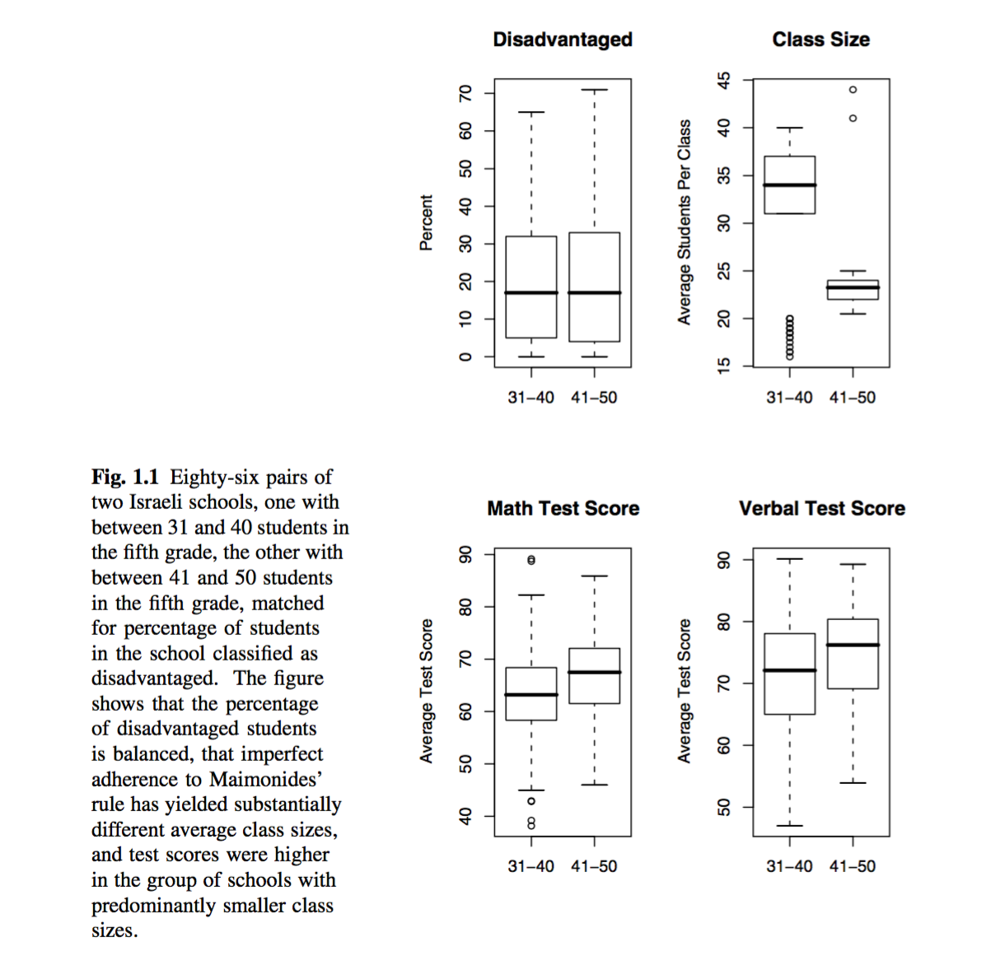

# Today's Class

- Design of an observational study versus experiment
- Maimonides' rule (an example of a natural experiment)
- Introduction to the propesnity score

# The design phase of an observational study

Good observational studies are designed.  

> An observational study should be conceptualized as a broken randomized experiment ... in an observational study we view the observed data as having arisen from a hypothetical complex randomized experiment with a lost rule for the [assignment mechanism], whose values we will try to reconstruct.
Rubin (2007)

# The design phase of an observational study

> Of critical importance, in randomized experiments the design phase takes place prior to seeing any outcome data. And this critical feature of randomized experiments can be duplicated in observational studies, for example, using propensity score methods, and we should objectively approximate, or attempt to replicate, a randomized experiment when designing an observational study. Rubin (2007)


# Looking for Causal Treatment Effects

- Compare survival in patients who are treated with a drug therapy versus surgery in a randomized control trial.
- If patients that undergo surgery live 8 years and patients that take drug therapy live 5 years then the treatment effect is 8-5=3.

# Observational versus Randomized Studies

- In observational studies the researcher does not randomly allocate the treatments.
- Randomization ensures subjects receiving different treatments are comparable.

# Observational Studies

- Suppose that we have an outcome measured on two groups of subjects (treated and control).
- We want to make a fair comparison between the treated group and the control group in terms of the outcome.
- We can obtain covariates that describe the subjects before they received treatments, but we can’t ensure that the groups will be comparable in terms of the covariates.

# Importance of Randomization
- Randomization tends to produce relatively comparable or “balanced” treatment groups in large experiments.
- The covariates aren’t used in assigning treatments in an experiment.
- There’s no deliberate balancing of the covariates – it’s just a nice feature of randomization.
- We have some reason to hope and expect that other (unmeasured) variables will be balanced, as well.

# Smoking cessation and weight gain

What is the effect of smoking on weight gain?

- Data was used from The National Health and Nutrition Examination Survey Data I Epidemiological Follow-up Study (NHESFS) survey to assess this question.
- The NHESFS has information on sex, race, weight, height, education, alcohol use, and intensity of smoking at baseline (1971-75) and follow-up (1982) visits. 
- The survey was designed to investigate the relationships between clinical, nutritional, and behavioural factors. 
- A cohort of persons 25-74 who completed a medical exam in 1971-75 followed by a series of follow-up studies.
- Would it be possible to conduct a randomized study to evaluate the treatment effect?

# Smoking cessation and weight gain

```{r,cache=TRUE,echo=FALSE}
nhefshwdat <- read.csv("~/Dropbox/Docs/sta305/2015/assignments/Assignment2/nhefshw2dat.csv")
```

```{r,out.width=0.25, echo=FALSE}
# baseline characteristics
#nhefshwdat <- read.csv("~/Dropbox/Docs/sta305/2015/assignments/Assignment2/nhefshw2dat.csv")
years1 <-mean(nhefshwdat$age[nhefshwdat$qsmk == 1])
years0 <-mean(nhefshwdat$age[nhefshwdat$qsmk == 0])
male1 <-100*mean(nhefshwdat$sex[nhefshwdat$qsmk == 1]==0)
male0 <-100*mean(nhefshwdat$sex[nhefshwdat$qsmk == 0]==0)
white1 <-100*mean(nhefshwdat$race[nhefshwdat$qsmk == 1]==0)
white0 <-100*mean(nhefshwdat$race[nhefshwdat$qsmk == 0]==0)
university1 <-100*mean(nhefshwdat$education.code[nhefshwdat$qsmk == 1]==5)
university0 <-100*mean(nhefshwdat$education.code[nhefshwdat$qsmk == 0]==5)
kg1 <-mean(nhefshwdat$wt71[nhefshwdat$qsmk == 1])
kg0 <-mean(nhefshwdat$wt71[nhefshwdat$qsmk == 0])
cigs1 <-mean(nhefshwdat$smokeintensity[nhefshwdat$qsmk == 1])
cigs0 <-mean(nhefshwdat$smokeintensity[nhefshwdat$qsmk == 0])
smoke1 <-mean(nhefshwdat$smokeyrs[nhefshwdat$qsmk == 1])
smoke0 <-mean(nhefshwdat$smokeyrs[nhefshwdat$qsmk == 0])
noexer1 <-100*mean(nhefshwdat$exercise[nhefshwdat$qsmk == 1]==2)
noexer0 <-100*mean(nhefshwdat$exercise[nhefshwdat$qsmk == 0]==2)
inactive1 <-100*mean(nhefshwdat$active[nhefshwdat$qsmk == 1]==2)
inactive0 <-100*mean(nhefshwdat$active[nhefshwdat$qsmk == 0]==2)

baseline.char <- round(matrix(c(years1, years0, male1, male0, white1, white0, 
                                university1, university0, kg1, kg0, cigs1, cigs0, smoke1, smoke0, 
                                noexer1, noexer0, inactive1, inactive0),
                              ncol = 2, byrow=T), 1) 
dimnames(baseline.char) <- list(c("age, years", "men, %", "white, %", 
                                  "university, %", "weight, kg", 
                                  "Cigarettes/day", "year smoking", 
                                  "little/no exercise, %", 
                                  "inactive daily life, %"),
                                c("Cessation (A=1)","No cessation (A=0)"))
knitr::kable(baseline.char)
```

# Maimonides' Rule

{width=10%}

- Angrist and Lavy (1999) published an unusual study of the effects of class size on academic achievement.

- Causal effects of class size on pupil achievement is difficult to measure.

- The twelfth century Rabbinic scholar Maimonides interpreted the the Talmud’s discussion of class size as:

> “Twenty-five children may be put in charge of one teacher. If the number in the class exceeds twenty-five but is not more than forty, he should have an assistant to help with instruction. If there are more than forty, two teachers must be appointed.”


# Maimonides' Rule

{width=10%}

- Since 1969 it has been used to determine the division of enrolment cohorts into classes in Israeli public schools.

- Class size usually determined by affluence or poverty of a community, enthusiasm or skepticism about the value of education, special needs of students, etc.

- If adherence to Maimonides’s rule were perfectly rigid then with a single class size of 40 what would separate the same school with two classes whose average size is 20.5 is one student.

# Maimonides' Rule

{width=10%}

- Maimonides’ rule has the largest impact on a school with about 40 students in a grade cohort.

- With cohorts of size 40, 80, and 120 students, the steps down in average class size required by Maimonides’ rule when an additional student enrols are shown in the table.

Original Cohort Size | 40  | 80 | 120  |
---------------------|-----|----|------|
Class size with one  | 20.5|27  | 30.25|
additional student   |     |    |      |

# Maimonides' Rule

{width=10%}

- Angrist and Lavy looked at schools with fifth grade cohorts in 1991 with between 31 and 50 students, where average class sizes might be cut in half by Maimonides’ rule.

- There were 211 such schools, with 86 of these schools having between 31 and 40 students in fifth grade, and 125 schools having between 41 and 50 students in the fifth grade.

# Maimonides' Rule

{width=10%}

- Among the 211 schools with between 31 and 50 students in fifth grade, the percentage disadvantaged has a slightly negative Kendall’s correlation of −0.10.
- Strong negative correlations of −0.42 and −0.55, respectively, with performance on verbal and mathematics test scores.
- For this reason, 86 matched pairs of two schools were formed, matching to minimize to total absolute difference in percentage disadvantaged.

# Maimonides' Rule



# Maimonides' Rule

86 pairs of Israeli schools that are matched as follows:

1. One school with between 31 and 40 students in the fifth grade ($T = 0$),

2. One with between 41 and 50 students in the fifth grade ($T = 1$),
the pairs being matched for a covariate $x$ = percentage of disadvantaged students.

# Maimonides' Rule

- Strict adherence to Maimonides’ rule would require the slightly larger fifth grade cohorts to be taught in two small classes, and the slightly smaller fifth grade cohorts to be taught in one large class.
- Adherence to Maimonides’ rule was imperfect but strict enough to produce a wide separation in typical class size.

# Maimonides' Rule

- In their study, $(Y(1),Y(0))$ are average test scores in fifth grade if the fifth grade cohort was a little larger ($T=1$) or a little smaller ($T=0$).

- What separates a school with a slightly smaller fifth grade cohort ($T = 0$, 31–40 students) and a school with a slightly larger fifth grade cohort ($T = 1$, 41–50 students)?

- A handful of grade 5 students.

# Maimonides' Rule

- Seems plausible that whether or not a few more students enrol in the fifth grade is a haphazard event.

- An event not strongly related to the average test performance $(Y(1),Y(0))$ that the fifth grade would exhibit with a larger or smaller cohort.

- Building a study in the way that Angrist and Lavy did, it seems plausible that the propensity of a larger/smaller class are fairly close in the 86 matched pairs of two schools.

# Maimonides' Rule

A ‘natural experiment’ is an attempt to find in the world some rare circumstance such that a consequential treatment was handed to some people and denied to others for no particularly good reason at all, that is, haphazardly.

# Maimonides' Rule

- It does seem reasonable to think that probability of a larger class are fairly close for the 86 paired Israeli schools.

- This might be implausible in some other context, say in a national survey in Canada where schools are funded by local governments, so that class size might be predicted by the wealth or poverty of the local community.

# Maimonides' Rule

The figure shows that treatment reflects the haphazard element, namely susceptibility to Maimonides’ rule based on cohort size, rather than realized class size. Defining treatment in this way is analogous to an ‘intention-to-treat’ analysis in a randomized experiment.

\includegraphics[width=6cm,height=6cm]{maimonides.png}


# The propensity score

- Covariates are pre-treatment variables and take the same value for each unit no matter which treatment is applied.  
- For example, pre-treatment blood pressure or pre-test reading level are not influenced by a treatment that would alter blood pressure or reading level.  

The propensity score is $$e({\bf x})=P\left(T=1|{\bf x}\right),$$ where ${\bf x}$ are observed covariates.

The $i^{th}$ propensity score is the probability that a unit receives treatment given all the information, recorded as covariates, that is observed before the treatment.

# The propensity score

- In experiments the propensity scores are known.  

- In observational studies they can be estimated using models such as logistic regression where the outcome is the treatment indicator and the predictors are all the counfounding covariates.

# The propensity score

Consider a completely randomized design with $n=2$ units and one unit is assigned treatment. The treatment assignment for the $i^{th}$ subject is: 

$T_1$ | $T_2$  | $P(T_1)$ | $P(T_2)$ 
------|--------|----------|---------
0     | 0      | 0        | 0
0     | 1      | 0        | 0.5
1     | 0      | 0.5      | 0
1     | 1      | 0        | 0

Each unit's propensity score is ?.

# The propensity score

Consider a completely randomized design with $n=8$ units and three units are assigned treatment. 

- Each unit's propensity score is ?.  

- The probability of an particular treatment assignment is ?.

# The propensity score

```{r, comment="",message=FALSE, echo=FALSE}
library(combinat)
i <- combinat::combn(1:8,3)
colnames(i) <- (nth <- paste0(1:56, c("st Trt Assig", "nd Trt Assig", "rd Trt Assig", rep("th Trt Assig", 53))))
i[,1:3]
```

Each column corresponds to the units that will be treated; so the units that will not be treated are not included in the column.  For example in the first treatment assignment units 1, 2, 3 will be treated and units 4, 5, 6, 7, 8 will be given control. 

# The propensity score

- Consider a completely randomized design with $n$ units and $m$ units are assigned treatment. 
- Each unit has probability $\frac{m}{n}$ of receiving treatment (and $1-\frac{m}{n}$ of receiving control).  
- Thus, each person's propensity score is $m/n$.  
- The probability of a particular treatment assignment is $\frac{1}{{n \choose m}}$.

# The propensity score

- Consider a study that plans to use a doctor's medical records to compare two treatments ($T=0$ and $T=1$) given for a certain condition.  
- Treatments were not assigned to patients randomly, but were based on various measured and unmeasured patient factors.  

# Logistic Regression 

- The logistic regression model with one covariate $x$ is:$$ log \left( P(T_i=1)/P(T_i=0) \right)=\beta_0+\beta_1x_i$$

- The logistic regression model with $k$ covariates $x_1,x_2,...,x_k$ is $$ log \left( P(T_i=1)/P(T_i=0) \right)=\beta_0+\beta_1x_{i1}+ \cdots +\beta_1x_{ik} $$

# Parameter Estimates from Logistic Regression 

- In a logistic model with one binary covariate the parameter estimate of $\beta_1$ is: $$ \frac{\left( P(T=1|x=1)/P(T=0|x=1) \right)}{\left( P(T=1|x=0)/P(T=0|x=0) \right)}=exp(\beta_1)$$

- $exp(\beta_1)$ is the odds ratio comparing those with $x=1$ to those with $x=0$.


# Predicted probabilities from Logistic Regression  

- In a logistic model with one binary covariate the predicted probabilities can be calculated using the fitted model:

$$ {\hat p_i}= \frac {exp\left({\hat \beta_0}+{\hat \beta_1} x_{i1} \right)} {1+ exp\left({\hat \beta_0}+{\hat \beta_1} x_{i1} \right)}$$


# The propensity score

- The patient factors that were measured are age ($x_1$), sex ($x_2$), and health status before treatment ($x_3$).  

- The propensity score can be estimated for each patient by fitting a logistic regression model with treatment as the dependent variable and $x_1, x_2, x_3$ as the predictor variables.

$$log\left(\frac{p_i}{1-p_i} \right)={\hat \beta_0}+{\hat \beta_1} x_{i1} + {\hat \beta_2} x_{i2} +{\hat \beta_3} x_{i3},$$ where $p_i=P(T_i=1).$  


# The propensity score

- The predicted probabilities from the above equation are estimates of the propensity score for each patient.

$$ {\hat p_i}= \frac {exp\left({\hat \beta_0}+{\hat \beta_1} x_{i1} + {\hat \beta_2} x_{i2} +{\hat \beta_3} x_{i3} \right)} {1+ exp\left({\hat \beta_0}+{\hat \beta_1} x_{i1} + {\hat \beta_2} x_{i2} +{\hat \beta_3} x_{i3} \right)}$$

# The propensity score in Smoking Cessation Study

The propensity score for each subject in smoking and weight gain study can be estimated by fitting a logistic regression model.

```{r,cache=TRUE, message=FALSE,comment="",eval=FALSE}
prop.model <- glm(qsmk ~ as.factor(sex) + as.factor(race) + 
                  age + as.factor(education.code) + smokeintensity + 
                  smokeyrs  + as.factor(exercise) + as.factor(active) + 
                  wt71, family = binomial(), data = nhefshwdat)

#Summary of propensity score model
summary(prop.model)
```

# The propensity score in Smoking Cessation Study

```{r,cache=TRUE, message=FALSE,comment="",echo=FALSE,message=FALSE,comment="",collapse=TRUE}
prop.model <- glm(qsmk ~ as.factor(sex) + as.factor(race) + 
                    age + as.factor(education.code) + smokeintensity + 
                    smokeyrs  + as.factor(exercise) + as.factor(active) + 
                    wt71, family = binomial(), data = nhefshwdat)

#Summary of propensity score model
summary(prop.model)$coef
```

# How do we build a propensity score model?

* Usual tool is logistic regression model for the treatment allocation decision.
* We therefore want to consider including any variables that have a relationship to the treatment decision (i.e. precede it in time, and are relevant)
* No information is included on the actual treatment received, or on the outcome(s).

# Ten commandments of Propensity Model Development

1. Thou shalt value parsimony.
2. Thou shalt examine thy predictors for collinearity.
3. Thou shalt test all thy predictors for statistical significance.
4. Thou shalt have ten times as many predictors as subjects.
5. Thou shalt examine thy regression coefficients
6. Thou shalt perform bootstrap analyses to assess shrinkage.
7. Thou shalt perform regression diagnostics and examine residuals with care.
8. Thou shalt hold out a sample of thy data for cross-validation.
9. Thou shalt perform external validation on a new sample of data.
10. Thou shalt ignore commandments 1 through 9 and instead ensure that the model adequately balances covariates.

# Propensity model development

1. Diagnostics for the successful prediction of probabilities and parameter estimates underlying those probabilities

2. Diagnostics for the successful design of observational studies based on estimated propensity scores.


-  2. is important 1. is not important in PS development.

# Propensity model development

- All covariates that subject matter experts (and subjects) judge important when selecting treatments.
- All covariates that relate to treatment and outcome, including any covariate that improves prediction (of exposure group).
- As much “signal” as possible.


