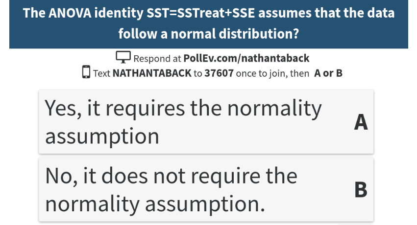

# Today's class

- ANOVA table
- ANOVA identity
- Degrees of freedom and ANOVA table
- Geometry of ANOVA
- Two estimates of the population variance
- Mean squares
- F statistic
- Assumptions


# Comparing more than two treatments

If interest is in designing an experiment to compare more than two treatments then the previous designs will need to modified.

- A clinical trial comparing three drugs A, B, C to reduce duration of intubation for patients on mechanical ventilation.

- Coagulation time of blood samples for animals receiving four different diets A, B, C, D.

What are the null and alternative hypotheses in these two scenarios?

# Blood Coagulation Study

- 24 animals were randomized to four treatments with 6 animals in each group.

- How many possible treatment assignments?  

# Blood Coagulation Study

- The data for coagulation times for blood samples drawn from 24 animals receiving four different diets A, B, C, and D are shown below. 


```{r,echo=FALSE,cache=TRUE,warning=FALSE}
tab0401 <- read.table("~/Dropbox/Docs/sta305/BHHData/BHH2-Data/tab0401.dat", header=TRUE, quote="\"")
library(BHH2)
```


```{r,echo=F,cache=T,warning=FALSE}
library(tidyr)
data_wide <- spread(tab0401, diets, y)
A <- data_wide$A[is.na(data_wide$A)==F]
B <- data_wide$B[is.na(data_wide$B)==F]
C <- data_wide$C[is.na(data_wide$C)==F]
D <- data_wide$D[is.na(data_wide$D)==F]
ave <- c(mean(A),mean(B),mean(C),mean(D))
gave <- rep(mean(tab0401$y),4)
diff <- ave-gave
dat <- rbind(cbind(A,B,C,D),ave,gave,diff)
row.names(dat) <- c("","","","","","","Treatment Average", "Grand Average","Difference")
knitr::kable(dat,col.names=c("A","B","C","D"))
```

# Blood Coagulation Study

```{r, cache=TRUE,autodep=TRUE,echo=FALSE}
boxplot(y~diets,data=tab0401,xlab="Diets",
        ylab="Coagulation time",
        main="Coagulation time from 24 animals randomly allocated to four diets")
```


Do the boxplots show evidence of a difference between diets?


# Analysis of Variance (ANOVA)

- An idea due to Fisher is to compare the variation in mean coagulation times *between* the diets to the variation of coagulation times *within* a diet. These two measures of variation are often summarized in an analysis of variance (ANOVA) table. 

- Fisher introduced the method in his 1925 book "Statistical Methods for Research Workers".
- The statistical procedure enables experimenters to answer several questions at once.
- The prevailing method at the time was to test one factor at a time in an experiment.

# Analysis of Variance (ANOVA) table

- The between treatments variation and within treatment variation are two components of the total variation in the response.

- In the coagulation study data we can break up each observation's deviation from the grand mean into two components: treatment deviations; and residuals within treatment deviations. 

- Let $y_{ij}$ be the $jth$ ($j=1,....,6$) observation taken under treatment $i=1,2,3,4$.

$$y_{ij}-{\bar y}_{\cdot \cdot}=\underbrace{\left(y_{i \cdot}-{\bar y}_{\cdot \cdot}\right)}_{\text {treatment deviation}}+\underbrace{\left(y_{ij}-{\bar y}_{i \cdot}\right)}_{\text {residual deviation}}$$

$$ y_{i\cdot}=\sum_{j=1}^n y_{ij}, \hspace{1cm} {\bar y}_{i\cdot}=y_{i\cdot}/n,$$

$$ y_{\cdot \cdot}=\sum_{i=1}^a \sum_{j=1}^n y_{ij}, \hspace{1cm} {\bar y}_{\cdot \cdot}=y_{\cdot \cdot}/N,$$

# Analysis of Variance (ANOVA) model

- Let $y_{ij}$ be the $jth$ observation taken under treatment $i=1,...,a$. $$E(y_{ij})=\mu_i=\mu+\tau_i,$$ and $Var(y_{ij})=\sigma^2$ and the observations are mutually independent.  

- The parameter $\tau_i$ is the $ith$ treatment effect. 
- The parameter $\mu$ is the overall mean. 

# Analysis of Variance (ANOVA) model

We are interested in testing if the $a$ treatment means are equal.

$$H_0: \mu_1=\cdots=\mu_a \hspace{0.5cm}\text{vs.}\hspace{0.5cm}  H_1: \mu_i \ne \mu_j, \thinspace i \ne j.$$ 

There will be $n$ observations under the $ith$ treatment.

$$ y_{i\cdot}=\sum_{j=1}^n y_{ij}, \hspace{1cm} {\bar y}_{i\cdot}=y_{i\cdot}/n,$$

$$ y_{\cdot \cdot}=\sum_{i=1}^a \sum_{j=1}^n y_{ij}, \hspace{1cm} {\bar y}_{\cdot \cdot}=y_{\cdot \cdot}/N,$$

where $N=an$ is the total number of observations.  The "dot"  subscript notation means sum over the subscript that it replaces.


# The ANOVA identity

The total sum of squares $SS_{T}= \sum_{i=1}^a \sum_{j=1}^n \left(y_{ij}- {\bar y}_{\cdot \cdot}\right)^2$ can be written as

$$ \sum_{i=1}^a \sum_{j=1}^n \left[({\bar y}_{i\cdot} - {\bar y}_{\cdot \cdot}) + (y_{ij}- {\bar y}_{i \cdot})\right]^2$$
 
by adding and subtracting ${\bar y}_{i\cdot}$ to $SS_T$. 

It can be shown that 

$$ \begin{aligned}
SS_T = \sum_{i=1}^a \sum_{j=1}^n \left(y_{ij}-{\bar y}_{\cdot \cdot}\right)^2 &= \underbrace{n\sum_{i=1}^a \left(y_{i \cdot}-{\bar y}_{\cdot \cdot}\right)^2}_{\text{Sum of Squares Due to Treatment}} + \underbrace{\sum_{i=1}^a \sum_{j=1}^n \left(y_{ij}-{\bar y}_{i \cdot} \right)^2}_{\text{Sum of Squares Due to Error}} \label{eq1} \\
   &= SS_{Treat} + SS_E.
\end{aligned}$$

# The ANOVA identity

This is sometimes called the analysis of variance identity.  It shows how the total sum of squares can be split into two sum of squares: one part that is due to differences between treatments; and one part due to differences within treatments.

# The ANOVA identity


```{r,echo=F,cache=T}
library(tidyr)
data_wide <- spread(tab0401, diets, y)
A <- data_wide$A[is.na(data_wide$A)==F]
B <- data_wide$B[is.na(data_wide$B)==F]
C <- data_wide$C[is.na(data_wide$C)==F]
D <- data_wide$D[is.na(data_wide$D)==F]
ave <- c(mean(A),mean(B),mean(C),mean(D))
gave <- rep(mean(tab0401$y),4)
diff <- ave-gave
dat <- rbind(cbind(A,B,C,D),ave,gave,diff)
row.names(dat) <- c("","","","","","","Treatment Average", "Grand Average","Difference")
knitr::kable(dat,col.names=c("A","B","C","D"))
```

- The decomposition of the first observation $y_{11}=60$ in diet A is 
$$\begin{aligned}
y_{11}-{\bar y}_{\cdot \cdot}&=\left(y_{1 \cdot}-{\bar y}_{\cdot \cdot}\right)+\left(y_{11}-{\bar y}_{1 \cdot}\right) \\
60-64&=(61-64)+(60-61)\\
-4 &=-3+-1
\end{aligned}$$

- If each observation is decomposed in this manner then there will be three tables of residuals: total residuals; between treatment residuals; and within treatment residuals.

# Example - Blood coagulation study ($SS_T$)

The deviations from the grand average $\left(y_{ij}-{\bar y}_{\cdot \cdot}\right)$  are in the table below:

```{r,echo=FALSE,comment=""}
a <- cbind(A-64,B-64,C-64,D-64)
colnames(a) <- c("A","B","C","D")
row.names(a) <- rep("",6)
a
```

The total sum of squares is obtained by squaring all the entries in this table and summing:  $SS_T=(-4)^2+(-1)^2 + \cdots + (-8)^2=$ `r sum(a^2)`.


# Example - Blood coagulation study ($SS_{Treat}$)


The between treatment deviations $\left(y_{i \cdot}-{\bar y}_{\cdot \cdot}\right)$ are in the table below:

```{r,echo=FALSE,comment=""}
b <- cbind(rep(diff[1],6),rep(diff[2],6),rep(diff[3],6),rep(diff[4],6))
colnames(b) <- c("A","B","C","D")
row.names(b) <- rep("",6)
b
```

The sum of squares due to treatment is obtained by squaring all the entries in this table and summing: $SS_{Treat} = (-3)^2 + (2)^2 + \cdots +(-3)^2=$ `r sum(b^2)`.

# Example - Blood coagulation study ($SS_{E}$)

The within treatment deviations $\left(y_{ij}-{\bar y}_{i \cdot} \right)$ are in the table below:

```{r,echo=FALSE,comment=""}
c <- cbind(A-mean(A),B-mean(B),C-mean(C),D-mean(D))
colnames(c) <- c("A","B","C","D")
row.names(c) <- rep("",6)
c
```

The sum of squares due to error $\left(y_{ij}-{\bar y}_{i \cdot} \right)$ is obtained by squaring the entries in this table and summing:  $SS_E=(-1)^2+(2)^2+\cdots+(-5)^2=$ `r sum(c^2)`. 

$$\underbrace{340}_{SS_T} =\underbrace{228}_{SS_{Treat}}+\underbrace{112}_{SS_E}.$$

Which illustrates the ANOVA identity for the blood coagulation study.

# ANOVA - degrees of freedom

The deviations 

- $SS_{Treat}$ is called the sum of squares due to treatments (i.e., between treatments), and $SS_E$ is called the sum of squares due to error (i.e., within treatments).
- There are $an=N$ total observations.  So $SS_T$ has $N-1$ degrees of freedom.
- There are $a$ treatment levels so $SS_{Treat}$ has $a-1$ degrees of freedom.
- Within each treatment there are $n$ replicates with $n-1$ degrees of freedom.  There are $a$ treatments.  So, there are $a(n-1)=an-a=N-a$ degrees of freedom for error. 
 


# Geometry and the ANOVA Table

```{r,echo=FALSE,comment="",cache=TRUE}
a <- cbind(A-64,B-64,C-64,D-64)
colnames(a) <- c("A","B","C","D")
row.names(a) <- rep("",6)
b <- cbind(rep(diff[1],6),rep(diff[2],6),rep(diff[3],6),rep(diff[4],6))
colnames(b) <- c("A","B","C","D")
row.names(b) <- rep("",6)
c <- cbind(A-mean(A),B-mean(B),C-mean(C),D-mean(D))
colnames(c) <- c("A","B","C","D")
row.names(c) <- rep("",6)
a
b
c
```


# Geometry and the ANOVA Table

- Let $a$ be the vector of deviations from the grand mean, 
- Let $b$ be the vector of deviations of treatment deviations
- Let $c$ be the vector of within-treatment deviations.

$a=$(`r a`), 
$b=$(`r b`), 
$c=$(`r c`).

# Geometry and the ANOVA Table

- The dot product of $b$ and $c$, $b \cdot c$, is

```{r,comment=""}
b*c
sum(b*c)
```
- Therefore, the vectors $b$ and $c$ are orthogonal.
- Thus, the vector $a$ is the hypotenuse of a right triangle with sides $b$ and $c$.

# Geometry and the ANOVA Table

Pythagoras' theorem in $n$ dimensions is $|a|^2=|b|^2+|c|^2$, where $|a|=\sqrt{a_1^2+\cdots+a_n^2}.$

The ANOVA identity can be seen using Pythagoras' theorem since

$$|a|^2=SS_T, |b|^2=SS_{Treat}, |c|^2=SS_E.$$

If there were only three observations then the vectors would be as shown below. 

$$\setlength{\unitlength}{0.20mm}
\begin{picture}(500,150)
\put(75,10){\line(1,0){130}}
\put(100,-5){$b$}
\put(75,10){\line(0,1){130}}
\put(60,50){$c$}
\put(75,140){\line(1,-1){130}}
\put(170,50){$a$}
\end{picture}$$

The degrees of freedom are the dimensions in which the vectors are free to move given the constraints.

# Geometry and the ANOVA Table



# ANOVAs Two Estimates of the Population Variance ($\sigma^2$)

$$SS_E= \sum_{i=1}^a \left[\sum_{j=1}^n \left(y_{ij}-{\bar y}_{i \cdot} \right)^2\right]$$

If the term inside the brackets is divided by $n-1$ then it is the sample variance for the $ith$ treatment

$$S_i^2=\frac{\sum_{j=1}^n \left(y_{ij}-{\bar y}_{i \cdot} \right)^2}{n-1}, \hspace{1cm} 1=1,...,a.$$

Combining these $a$ variances to give a single estimate of the common population variance

$$\frac{(n-1)S_1^2+ \cdots + (n-1)S_a^2}{(n-1)+ \cdots + (n-1)}=\frac{SS_E}{N-a}.$$

Thus, $SS_E$ is a pooled estimate of the common variance $\sigma^2$ within each of the $a$ treatments.

# ANOVAs Two Estimates of the Population Variance ($\sigma^2$)

If there were no differences between the $a$ treatment means ${\bar y}_{i \cdot}$ we could use the variation of the treatment averages from the grand average to estimate $\sigma^2$.

$$\frac{{n\sum_{i=1}^a \left(y_{i \cdot}-{\bar y}_{\cdot \cdot}\right)^2}}{a-1}=\frac{SS_{Treat}}{a-1}$$

is an estimate of $\sigma^2$ when the treatment means are all equal.
 
# ANOVAs Two Estimates of the Population Variance ($\sigma^2$) 
 
- The analysis of variance identity gives two estimates of $\sigma^2$.  

- One is based on the variability within treatments and one based on the variability between treatments.  
- If there are no differences in the treatment means then these two estimates should be similar.  
- If these estimates are different then this could be evidence that the difference is due to differences in the treatment means.

# ANOVA - Mean square error

The mean square for treatment is defined as

$$MS_{Treat}=\frac{SS_{Treat}}{a-1}$$

and the mean square for error is defined as

$$MS_E=\frac{SS_E}{N-a}.$$

# ANOVA - F statistic

- $SS_{Treat}$ and $SS_E$ are independent. 
- It can be shown that $SS_{Treat}/\sigma^2 \sim \chi^2_{a-1}$ and $SS_E/\sigma^2 \sim \chi^2_{N-a}$.  
- Thus, if $H_0:  \mu_1=\cdots=\mu_a$ is true then the ratio

$$ F= \frac{MS_{Treat}}{MS_E} \sim F_{a-1,N-a}.$$
