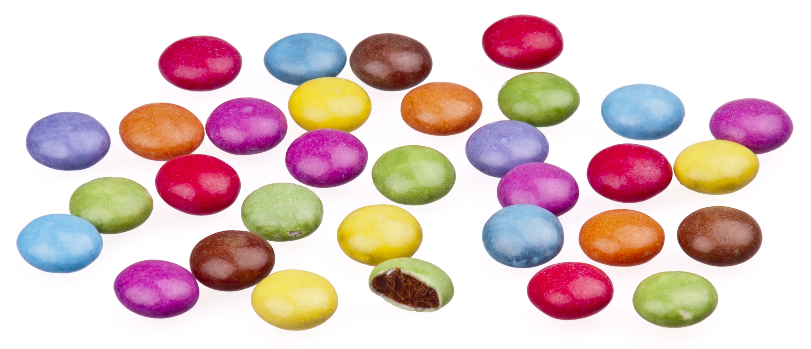
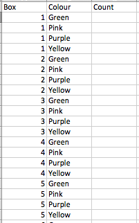

# Today's class

- ANOVA demonstrtation
- Estimating Treatment Effects in ANOVA using Regression
- Coding Qualitative Predictors in Regression Models

# ANOVA Demonstration

- 

- Count the total number of each colour (e.g., yellow, purple, pink, green).

- Eat the Smarties.

# ANOVA Data Setup

- How should the data be setup?

- 


# Smarties Data from 3 boxes
```{r,comment=""}
count <- c(4,3,4,3,1,4,2,5,1,1,2,4)
colour <- as.factor(c(rep("Yellow",3),rep("Purple",3),
                      rep("Green",3),rep("Pink",3)))
#Get means for each flavour
sapply(split(count,colour),mean)
```

# Estimating Treatment Effects in ANOVA using Regression

- $y_{ij}$ is the $j^{th}$ observation under the $i^{th}$ treatment. 
- The model for smarties $y_{ij}=\mu+\tau_i+\epsilon_{ij}$, $\epsilon_{ij} \sim N(0,\sigma^2)$ can be written in terms of the dummy variables $X_1, X_2, X_3$ as:

$$ y_{ij}=\mu+\tau_1X_{1j}+\tau_2X_{2j}+\tau_3X_{3j}+\epsilon_{ij}.$$
- What is $y_{ij},\mu, \tau_i, X_{ij}, \epsilon_{ij}$?

# The ANOVA Table

```{r,comment=""}
#ANOVA table
anova(lm(count~colour))
```


# Dummy coding

- Dummy coding compares each level to the reference level.  The intercept is the mean of the reference group.

- Dummy coding is the default in R and the most common coding scheme.  It compares each level of the categorical variable to a fixed reference level. 

```{r,comment=""}
contrasts(colour) <- contr.treatment(4)  #Treatment contrast
contrasts(colour) # print dummy coding
lm(count~colour)
```

# Deviation coding

- This coding system compares the mean of the dependent variable for a given level to the overall mean of the dependent variable.

```{r,comment=""}
contrasts(colour) <- contr.sum(4)  # Deviation contrast
contrasts(colour) # print deviation coding
lm(count~colour)
```