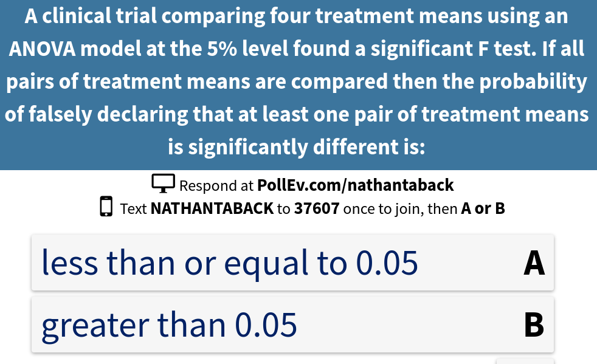

# Today's Class

- Coding qualitative predictors in regression models
- Estimating treatment effects using least squares
- Multiple comparisons
- Sample size for ANOVA


# Coding Qualitative Predictors in Regression Models

- A dummy or indicator variable in a regression takes on a finite number of values so that different categories of a nominal variable can be identified. 
- The term dummy reflects the fact that the values taken on by such variables (e.g., 0, 1, -1) do not indicate meaningful measurements but rather categories of interest. (Kleinbaum et al., 1998)

# Coding Qualitative Predictors in Regression Models

Consider a regression model: $y=\beta_0+\beta_1X_i+\epsilon$

Examples of dummy variables are:

$$X_1 =
\left\{
	\begin{array}{ll}
		1  & \mbox{if treatment A } \\
		0 & \mbox{otherwise}
	\end{array}
\right.$$

$$X_2 =
\left\{
	\begin{array}{ll}
		1  & \mbox{if subject is male } \\
	 -1 & \mbox{if subject is female}
	\end{array}
\right.$$

The variables $X_1,X_2$ are nominal variables describing treatment group and sex respectively.  

# Coding Qualitative Predictors in Regression Models

The following rule should be applied to avoid collinearity in defining a dummy variable for regression analysis: 

> if the nominal independent variable of interest has $k$ categories then exactly $k-1$ dummy variables should be defined to index the categories if the regression model contains an intercept term.

# Dummy Coding

- Dummy coding compares each level to the reference level.  
- The intercept is the mean of the reference group.
- Suppose that we would like to compare the mean number of candy colours in each box.  The data from 3 smarties boxes are below.

```{r,cache=TRUE,echo=TRUE}
count <- c(4,3,4,3,1,4,2,5,1,1,2,4)
colour <- as.factor(c(rep("Yellow",3),rep("Purple",3),
                      rep("Green",3),rep("Pink",3)))
```

```{r,echo=FALSE}
knitr::kable(data.frame(colour,count))
```

# Dummy Coding

The average and sd of each colour is:

```{r}
#Get means for each flavour
sapply(split(count,colour),mean) 
#Get standard deviations for each flavour
sapply(split(count,colour),sd)
```

# Dummy Coding

```{r}
boxplot(count~colour)
```


# Dummy Coding

Dummy coding is the default in R and the most common coding scheme.  It compares each level of the categorical variable to a fixed reference level. 

```{r}
contrasts(colour) <- contr.treatment(4)
contrasts(colour)  # print dummy coding - base is Green
```

Green is the reference category.  The first column compares Pink to Green, the second column compares Purple to Green, and the third column compares Yellow to Green.  The the three columns define three dummy variables:

# Dummy Coding

$$X_1 =
\left\{
	\begin{array}{ll}
		1  & \mbox{if smartie is pink } \\
		0 & \mbox{otherwise}
	\end{array}
\right.$$

$$X_2 =
\left\{
	\begin{array}{ll}
		1  & \mbox{if smartie is purple } \\
		0 & \mbox{otherwise}
	\end{array}
\right.$$

$$X_3 =
\left\{
	\begin{array}{ll}
		1  & \mbox{if smartie is yellow } \\
		0 & \mbox{otherwise}
	\end{array}
\right.$$

If $X_1=X_2=X_3=0$ then the colour of the smartie is green - the reference category.  This shows that we only require 3 dummy variables to define a nominal variable with 4 categories.

#Dummy Coding

To change the reference level change the value of base in `contr.treatment()`.
```{r}
contrasts(colour) <- contr.treatment(4,base = 2) # Now reference is pink
contrasts(colour)  
contrasts(colour) <- contr.treatment(4,base = 4) # Now reference is yellow
contrasts(colour)  
```

# Deviation Coding

- This coding system compares the mean of the dependent variable for a given level to the overall mean of the dependent variable.  


- $$X_1 =
\left\{
	\begin{array}{ll}
		1  & \mbox{if smartie is green } \\
		-1 & \mbox{if smartie is yellow} \\
		0 & \mbox{otherwise}
	\end{array}
\right.$$

$$X_2 =
\left\{
	\begin{array}{ll}
		1  & \mbox{if smartie is pink } \\
		-1 & \mbox{if smartie is yellow} \\
		0 & \mbox{otherwise}
	\end{array}
\right.$$

$$X_3 =
\left\{
	\begin{array}{ll}
		1  & \mbox{if smartie is purple } \\
		-1 & \mbox{if smartie is yellow} \\
		0 & \mbox{otherwise}
	\end{array}
\right.$$

- 1 is used to compare a level to all other levels and -1 is assigned to yellow because it's the level that will never be compared to the other levels.

- In R the variables can be created using the `contr.sum()` function.  
- The argument of 4 in `contr.sum(4)` indicates the number of levels of the factor.

# Deviation Coding

```{r}
contrasts(colour) <- contr.sum(4)
contrasts(colour)  
```

# Example - blood coagualtion study

The table below gives coagulation times for blood samples drawn from 24 animals receiving four different diets A, B, C, and D.

```{r,echo=FALSE,cache=TRUE,message=FALSE}
tab0401 <- read.table("~/Dropbox/Docs/sta305/BHHData/BHH2-Data/tab0401.dat", header=TRUE, quote="\"")
library(BHH2)
```

```{r,echo=F,cache=T,message=FALSE}
library(tidyr)
data_wide <- spread(tab0401, diets, y)
A <- data_wide$A[is.na(data_wide$A)==F]
B <- data_wide$B[is.na(data_wide$B)==F]
C <- data_wide$C[is.na(data_wide$C)==F]
D <- data_wide$D[is.na(data_wide$D)==F]
ave <- c(mean(A),mean(B),mean(C),mean(D))
gave <- rep(mean(tab0401$y),4)
diff <- ave-gave
dat <- rbind(cbind(A,B,C,D),ave,gave,diff)
row.names(dat) <- c("","","","","","","Treatment Average", "Grand Average","Difference")
knitr::kable(dat,col.names=c("A","B","C","D"))
```


# Estimating treatment effects using least squares 

$y_{ij}$ is the $j^{th}$ observation under the $i^{th}$ treatment. Let $\mu$ be the overall mean.  The model for diet $y_{ij}=\mu+\tau_i+\epsilon_{ij}$, $\epsilon_{ij} \sim N(0,\sigma^2)$ can be written in terms of the dummy variables $X_1, X_2, X_3$ as:

$$ y_{ij}=\mu+\tau_1X_{1j}+\tau_2X_{2j}+\tau_3X_{3j}+\epsilon_{ij},$$

where,  

$$X_{1j} =
\left\{
	\begin{array}{ll}
		1  & \mbox{if jth unit recieves diet 2 } \\
		0 & \mbox{otherwise}
	\end{array}
\right.$$

$$X_{2j} =
\left\{
	\begin{array}{ll}
		1  & \mbox{if jth unit recieves diet 3 } \\
		0 & \mbox{otherwise}
	\end{array}
\right.$$

$$X_{3j} =
\left\{
	\begin{array}{ll}
		1  & \mbox{if jth unit recieves diet 4 } \\
		0 & \mbox{otherwise}
	\end{array}
\right.$$


# Estimating treatment effects using least squares 

It follows that $E(y_{Aj})=\mu_A=\mu$ is the mean of diet A so 

$$\begin{aligned}
E(y_{Bj})=\mu_B=\mu_A+\tau_1 &\Rightarrow \tau_1=\mu_B-\mu_A \\ 
E(y_{Cj})=\mu_C=\mu_A+\tau_2 &\Rightarrow \tau_2=\mu_C-\mu_A \\ 
E(y_{Dj})=\mu_D=\mu_A+\tau_3 &\Rightarrow \tau_3=\mu_D-\mu_A   
\end{aligned}$$


The least squares estimates are: 

$$\begin{aligned}
{\hat \mu}&={\bar y}_{1 \cdot}, \\
{\hat \tau_1}&={\bar y}_{2 \cdot}-{\bar y}_{1 \cdot}, \\
{\hat \tau_2}&={\bar y}_{3 \cdot }-{\bar y}_{1 \cdot}, \\
{\hat \tau_3}&={\bar y}_{3 \cdot }-{\bar y}_{1 \cdot}.
\end{aligned}$$


# Estimating treatment effects using least squares 

- This model can also be written in matrix notation 

$$y=X\beta+\epsilon$$, 

where $\beta=\left(\mu,\tau_1,\tau_2,\tau_3 \right), X=({\bf 1},X_{i1},X_{i2},X_{i3})$, and $\epsilon=(\epsilon_{ij})$. 

- $X$ is an $24 \times 4$ design matrix with ${\bf 1}$ is a $24\times 1$ column vector of 1s, and $\epsilon$ is an $24 \times 1$ column vector.  
- Note that $\tau_4$ corresponding to the 4th treatment is implicitly set to 0.  It is used as a constraint so that that $(X'X)^{-1}$ exists.


# Example - blood coagualtion study (treatment coding)

```{r,cache=TRUE,comment="",cache=TRUE}
contrasts(tab0401$diets)
lm.diets <- lm(y~diets,data=tab0401);round(summary(lm.diets)$coefficients,2)
```


# Example - blood coagualtion study (treatment coding)

The averages for each of the four diets are in the table below.

Diet | A ($j=1$) | B ($j=2$) | C ($j=3$) | D ($j=4$)
-----|---|---|---|---
Average (${\bar y}_{j \cdot})$| `r ave[1]` | `r ave[2]` | `r ave[3]`| `r ave[4]`|

$$\begin{aligned}
{\bar y}_{1 \cdot}&=61, \\ 
{\hat \tau_1}&={\bar y}_{2 \cdot}-{\bar y}_{1 \cdot}=5 \\ 
{\hat \tau_2}&={\bar y}_{3 \cdot }-{\bar y}_{1 \cdot}=7 \\ 
{\hat \tau_3}&={\bar y}_{3 \cdot }-{\bar y}_{1 \cdot}=-9.9 \times 10^{-15}.
\end{aligned}$$

# Example - blood coagualtion study (treatment coding)


The design matrix (first 12 observations) is

```{r}
model.matrix(lm.diets)[1:12,]
```


# Example - blood coagualtion study (treatment coding)

The design matrix (first 12 observations) with the observations $y$ and treatment variable `diets` (first 12 observations) is

```{r}
cbind(tab0401$y,tab0401$diets,model.matrix(lm.diets))[1:12,]
```


# Example - blood coagualtion study (deviation coding)

If deviation coding was used then the parameter estimates would represent different treatment effects.  In the regression model the dummy variables would be defined as 

$$X_1 =
\left\{
	\begin{array}{ll}
		1  & \mbox{if diet is A } \\
		-1 & \mbox{if diet is D} \\
		0 & \mbox{otherwise}
	\end{array}
\right.$$

$$X_2 =
\left\{
	\begin{array}{ll}
		1  & \mbox{if diet is B } \\
		-1 & \mbox{if diet is D} \\
		0 & \mbox{otherwise}
	\end{array}
\right.$$

$$X_3 =
\left\{
	\begin{array}{ll}
		1  & \mbox{if diet is C } \\
		-1 & \mbox{if diet is D} \\
		0 & \mbox{otherwise}
	\end{array}
\right.$$


# Example - blood coagualtion study (deviation coding)

It follows that 

$$\begin{aligned}
E(y_{Aj})&=\mu_A=\tau_0+\tau_1 \\
E(y_{Bj})&=\mu_B=\tau_0+\tau_2 \\
E(y_{Cj})&=\mu_C=\tau_0+\tau_3 \\
E(y_{Dj})&=\mu_D=\tau_0-\tau_1-\tau_2-\tau_3
\end{aligned}$$

So,

$$\begin{aligned}
\tau_0 &= \frac{\mu_A+\mu_B+\mu_C+\mu_D}{4} \\
\tau_1 &= \mu_A - \frac{\mu_A+\mu_B+\mu_C+\mu_D}{4} \\
\tau_2 &= \mu_B - \frac{\mu_A+\mu_B+\mu_C+\mu_D}{4} \\
\tau_3 &= \mu_C - \frac{\mu_A+\mu_B+\mu_C+\mu_D}{4} \\
\end{aligned}$$


# Example - blood coagualtion study (deviation coding)

```{r,cache=TRUE,comment=""}
attach(tab0401)
contrasts(tab0401$diets) <- contr.sum(4)
lm.diets <- lm(y~diets,data=tab0401)
round(summary(lm.diets)$coefficients,2)
```

- The estimate of the intercept $\hat \tau_0$ is the grand average. 
- The slope estimates $\hat{\tau_1}, \hat{\tau_2}, \hat{\tau_3}$ are the differences between the treatment averages and grand average of diets A, B, and C.


# Multiple Comparisons

Suppose that experimental units were randomly assigned to three treatment groups.  The hypothesis of intrest is:

$$H_0: \mu_1=\mu_2 =\mu_3 \thinspace {\text  vs. } \thinspace H_1: \mu_i \ne\mu_j.$$ 

Now, suppose that we reject $H_0$ at level $\alpha$.  Which pairs of means are significantly different from each other at level $\alpha$?  There are ${3 \choose 2}=3$ possibilites. 

1. $\mu_1 \ne \mu_2$
2. $\mu_1 \ne \mu_3$
3. $\mu_2 \ne \mu_3$

# Multiple Comparisons

Suppose that $k=3$ separate (independent) hypothesis tests at level $\alpha$ tests are conducted:

$$H_{0_k}: \mu_i=\mu_j  \thinspace {\text  vs. } \thinspace H_{1_k}: \mu_i \ne\mu_j,$$ 

When $H_0$ is true, $P\left(\text{reject } H_0 \right)=\alpha \Rightarrow 1- P\left(\text{do not reject } H_0 \right)=1-(1-\alpha)$.  

So, if $H_0$ is true then 

$$P\left(\text{reject at least one } H_{0_k} \right)=1- P\left(\text{do not reject any } H_{0_k} \right)$$ 

This is the same as 

$$1- P\left(\text{do not reject } H_{0_1} \text{and } \text{do not reject } H_{0_2} \text{and } \text{do not reject } H_{0_3}  \right)$$

or since the hypotheses are independent

$$1- P\left(\text{do not reject } H_{0_1}\right)P\left(\text{do not reject } H_{0_2}\right)P\left(\text{do not reject } H_{0_3}\right)= 1-(1-\alpha)^{3}$$

If $\alpha=0.05$ then the probability that at least one $H_0$ will be falsely rejected is $1-(1-.05)^3=0.14$, which is almost three times the type I error rate.

# Multiple Comparisons




# Multiple Comparisons

```{r,echo=FALSE}
library(ggplot2)
mcomp05 <- function(k){1-.95^k}
k <- 1:10
qplot(k,mcomp05(k),xlab="Number of hypothesis tests",ylab="Family-wise error rate",main = expression(paste("Family-wise error rate ",alpha,"=0.05")))+geom_line()
```


# Multiple Comparisons

In general if $$H_0: \mu_1=\mu_2 = \cdots =\mu_k \thinspace {\text  vs. } \thinspace H_1: \mu_i \ne\mu_j.$$ 

If $c$ independent hypotheses are conducted then the probability 

$$P\left(\text{reject at least one } H_{0_k} \right) = 1-(1-\alpha)^c$$

is called the **family-wise error rate**.

The **pairwise error rate** is $P\left(\text{reject } H_{0_k} \right)=\alpha$ for any $c$. 


# The Multiple Comparisons Problem

- The multiple comparison problem is that multiple hypotheses are tested level $\alpha$ which increases the probability that at least one of the hypotheses will be falsely rejected (family-wise error rate).  

- If treatment means are significantly different from the ANOVA F test then researchers will usually want to explore where the differences lie.  

- Is it appropriate to test for differences looking at all pairwise comparisons?

- Testing all possible pairs increases the type I error rate.
- This means the chance that there is a higher probability,  beyond the pre-stated type I error rate (e.g. 0.05), that that a significant difference is detected when the truth is that no difference exists.


# Example 


# The Bonferroni Method

To test for the difference between the $ith$ and $jth$ treatments, it is common to use the two-sample $t$ test. The two-sample $t$ statistic is

$$ t_{ij}= \frac{\bar{y_{j \cdot}}-\bar{y_{i \cdot}} } {\hat{\sigma}\sqrt{1/n_j+1/n_i}},$$

where $\bar{y_{j \cdot}}$ is the average of the $n_i$ observations for treatment $j$ and $\hat{\sigma}$ is $\sqrt{MS_E}$ from the ANOVA table.

Treatments $i$ and $j$ are declared significantly different at level $\alpha$ if

$$|t_{ij}|>t_{N-k,\alpha/2},$$

where $t_{N-k,\alpha/2}$ is the upper $\alpha/2$ percentile of a $t_{N-k}$.

# The Bonferroni Method


The total number of pairs of treatment means that can be tested is $$c={k \choose 2}=\frac{k(k-1)}{2}.$$

The Bonferroni method for testing $H_0:\mu_i=\mu_j$ vs. $H_0:\mu_i \ne \mu_j$ rejects $H_0$ at level $\alpha$ if 

$$|t_{ij}|>t_{N-k,\alpha/2c},$$

where $c$ denotes the number of pairs being tested.

# The Bonferroni Method

In R the function `pairwise.t.test()` can be used to compute Bonferroni adjusted p-values.  

This is illustrated below for the blood coagualtion study.

```{r}
pairwise.t.test(tab0401$y,tab0401$diets,p.adjust.method = "bonferroni")
```

There are signifciant differences at the 5% level between diets A and B, A and C, B and D, and C and D using the Bonferroni method.

# The Bonferroni Method

For comparison the unadjusted p-values are also calculated.

```{r}
pairwise.t.test(tab0401$y,tab0401$diets,p.adjust.method = "none")
```

The significant differences are the same using the unadjusted p-values but the p-values are larger then the p-values adjusted using the Bonferroni method.

# The Bonferroni Method

A 100$(1-\alpha)$% simultaneous confidence interval for $c$ pairs $\mu_i-\mu_j$ is

$$\bar{y_{j \cdot}}-\bar{y_{i \cdot}} \pm t_{N-k,\alpha/2c}\hat{\sigma}\sqrt{1/n_j+1/n_i}.$$

After identifying which pairs are different, the confidence interval quantifies the range of plausible values for the differences.

# The Bonferroni Method - coagulation study

The treatment means can be obtained from the table below.

```{r,echo=F,cache=T}
library(tidyr)
data_wide <- spread(tab0401, diets, y)
A <- data_wide$A[is.na(data_wide$A)==F]
B <- data_wide$B[is.na(data_wide$B)==F]
C <- data_wide$C[is.na(data_wide$C)==F]
D <- data_wide$D[is.na(data_wide$D)==F]
ave <- c(mean(A),mean(B),mean(C),mean(D))
gave <- rep(mean(tab0401$y),4)
diff <- ave-gave
dat <- rbind(cbind(A,B,C,D),ave,gave,diff)
row.names(dat) <- c("","","","","","","Treatment Average", "Grand Average","Difference")
knitr::kable(dat,col.names=c("A","B","C","D"))
```

# The Bonferroni Method - coagulation study

${\hat \sigma}=\sqrt{MS_E}$ can be obtained from the ANOVA table.  

```{r}
anova(lm(y~diets,data=tab0401))
```

The upper $.05/(2\cdot 6)=0.004$ percentile of the $t_{24-4}$ can be obtained with the t quantile function in R `qt()`.

```{r}
qt(p = 1-0.004,df = 20)
```

# The Bonferroni Method - coagulation study

Plugging in these values to the confidence interval formula we can obtain a Bonferroni adjusted 95% confidence interval for $\mu_B-\mu_A$:

$$ 66-61 \pm 2.95 \sqrt{5.6} \sqrt{1/6+1/6}$$

The lower and upper limits can be calculated in R.

```{r}
66-61 - qt(p = 1-0.004,df = 20)*sqrt(5.6)*sqrt(1/6+1/6) # lower limit
66-61 + qt(p = 1-0.004,df = 20)*sqrt(5.6)*sqrt(1/6+1/6) # upper limit
```

The 95% confidence interval for $\mu_B-\mu_A$ is ( `r round(66-61 - qt(p = 1-0.004,df = 20)*sqrt(5.6)*sqrt(1/6+1/6),2)`, `r round(66-61 + qt(p = 1-0.004,df = 20)*sqrt(5.6)*sqrt(1/6+1/6),2)` ).

# The Tukey Method

- The only difference between the Tukey and Bonferroni methods is in the choice of the critical value.  

- Treatments $i$ and $j$ are declared significantly different at level $\alpha$ if

$$|t_{ij}|>\frac{1}{\sqrt 2} q_{k,N-k,\alpha},$$

- $t_{ij}$ is the observed value of the two-sample t-statistic 
- $q_{k,N-k,\alpha}$ is the upper $\alpha$ percentile of the Studentized range distribution with parameters $k$ and $N-k$ degrees of freedom.
- The CDF and inverse CDF of the Studentized Range Distribution is available in R via the functions `ptukey()` and `qtukey()` respectively.

# The Tukey Method

A 100$(1-\alpha)$% simultaneous confidence interval for $c$ pairs $\mu_i-\mu_j$ is

$$\bar{y_{j \cdot}}-\bar{y_{i \cdot}} \pm \frac{1}{\sqrt 2} q_{k,N-k,\alpha} \hat{\sigma}\sqrt{1/n_j+1/n_i}.$$

The Bonferroni method is more conservative than Tukey's method. In other words, the simutaneous confidence intervals based on the Tukey method are shorter.

# The Tukey Method

- In the coagualtion study $N=24, k=4$ so the 5% critical value of the Studentized range distribution is obtained using the the inverse CDF function `qtukey()` for this distribution. 

- The argument `lower.tail=FALSE` is used so we obtain the upper percentile of the distribution (i.e., the value of $x$ such that $P\left(X>x\right)=0.05$). 

```{r}
qtukey(p = .05,nmeans = 4,df = 20,lower.tail = FALSE)
```

# The Tukey Method

- Let's obtain the Tukey p-value and confidence interval for $\mu_B-\mu_A$.  
- The observed value of the test statistic is 

$$q^{obs}=\sqrt{2}|t_{AB}|,$$

where $$t_{AB}=\frac{\bar{y_{A \cdot}}-\bar{y_{B \cdot}} } {\hat{\sigma}\sqrt{1/n_A+1/n_B}}.$$

```{r}
(sqrt(2)*(66-61))/(sqrt(5.6)*sqrt(1/6+1/6))
```

# The Tukey Method

The p-value 

$$P\left(q_{4,20}>q^{obs}\right)$$

is then obtained using the CDF of the Studentized range distribution

```{r}
1-ptukey(q = sqrt(2)*5/sqrt(2*5.6/6),nmeans = 4,df = 20)
```

# The Tukey Method

The 95% limits of the Tukey confidence interval for $\mu_B-\mu_A$ is

```{r,cache=TRUE}
tuk.crit <- qtukey(p=.05,nmeans=4,df=20,lower.tail=FALSE)
#lower limit
round(5-(1/sqrt(2))*tuk.crit*sqrt(5.6)*sqrt(1/6+1/6),2)
#upper limit
round(5+(1/sqrt(2))*tuk.crit*sqrt(5.6)*sqrt(1/6+1/6),2)
```

# The Tukey Method

The width of the Tukey confidence interval for $\mu_B-\mu_A$ is

```{r}
round((1/sqrt(2))*tuk.crit*sqrt(5.6)*sqrt(1/6+1/6),2)
```

The width of Bonferroni $\mu_B-\mu_A$ is

```{r}
round(qt(p = 1-0.004,df = 20)*sqrt(5.6)*sqrt(1/6+1/6),2)
```


# The Tukey Method

- This shows that the Tukey confidence interval is shorter than Bonferroni confidence intervals.

- The command `TukeyHSD()` can be used to obtain all the Tukey confidence intervals and p-values for an ANOVA.  

# The Tukey Method


```{r,eval=FALSE}
TukeyHSD(aov(y~diets,data=tab0401))
```

```{r,echo=TRUE}
round(TukeyHSD(aov(y~diets,data=tab0401))$diets,2)
```


# The Tukey Method

```{r}
plot(TukeyHSD(aov(y~diets,data=tab0401)))
```


# Sample size for ANOVA - Designing a study to compare more than two treatments 

- Consider the hypothesis that k means are equal vs. the alternative that at least two differ. 
- What is the probability that the test rejects if at least two means differ? 
- Power = $1-P({\text{Type II error}})$ is this probability.

# Sample size for ANOVA - Designing a study to compare more than two treatments 

The null and alternative hypotheses are:

$$H_0: \mu_1=\mu_2 = \cdots = \mu_k \thinspace {\text  vs. } \thinspace H_1: \mu_i \ne\mu_j.$$ 

The test rejects at level $\alpha$ if

$$MS_{Treat}/MS_E \ge F_{k-1,N-K,\alpha}.$$

The power of the test is

$$ 1- \beta= P\left(MS_{Treat}/MS_E \ge F_{k-1,N-K,\alpha} \right),$$

when $H_0$ is false.  

# Sample size for ANOVA - Designing a study to compare more than two treatments 

When $H_0$ is false it can be shown that:

- $MS_{Treat}/\sigma^2$ has a non-central Chi-square distribution with $k-1$ degrees of freedom and non-centrality parameter $\delta$.

- $MS_{Treat}/MS_E$ has a non-central $F$ distribution with the numerator and denominator degrees of freedom $k-1$ and $N-k$ respectively, and non-centrality parameter 

$$\delta = \frac{\sum_{i=1}^kn_i\left(\mu_i-{\bar \mu} \right)^2}{\sigma^2},$$

where $n_i$ is the number of observations in group $i$, ${\bar \mu}=\sum_{i=1}^k \mu_i/k$, and $\sigma^2$ is the within group error variance .

This is dentoted by $F_{k-1,N-k}(\delta)$.

# Direct calculation of Power

- The power of the test is 

$$P\left(F_{k-1,N-k}(\delta) > F_{k-1,N-K,\alpha} \right).$$

- The power is an increasing function $\delta$ 
- The power depends on the true values of the treatment means $\mu_i$, the error variance $\sigma^2$, and sample size $n_i$.
- If the experimentor has some prior idea about the treament means and error variance, and the sample size (number of replications) the formula above will calculate the power of the test.

# Blood coagulation example - sample size

Suppose that an investigator would like to replicate the blood coagulation study with only 3 animals per diet.  In this case $k=4, n_i=3.$  The treatment means from the initial study are:

Diet | A | B  | C | D 
-----|---|---|---|---
Average | `r ave[1]` | `r ave[2]` | `r ave[3]`| `r ave[4]`|

```{r}
anova(lm.diets)
```

# Blood coagulation example - sample size

- $\mu_1=$ `r ave[1]`, $\mu_2=$ `r ave[2]`, $\mu_3=$ `r ave[3]`, $\mu_4=$ `r ave[4]`.  
- The error variance $\sigma^2$ was estimated as $MS_E=5.6$.  
- Assuming that the estimated values are the true values of the parameters, the non-centrality parameter of the $F$ distribution is

$$\delta = 3 \times \left((61-64)^2+(66-64)^2+(68-64)^2+(61-64)^2\right)/5.6=20.35714$$

# Blood coagulation example - sample size

If we choose $\alpha=0.05$ as the significance level then $F_{3,20,0.05}=$ `r qf(p = .05,df1 = 3,df2 = 20,lower.tail=F)`. The power of the test is then 

$$P\left(F_{3,20}(20.36) > 3.10 \right)=0.94.$$

This was calculated using the CDF for the $F$ distribution in R `pf()`.

```{r}
1-pf(q = 3.10,df1 = 3,df2 = 20,ncp = 20.36)
```

# Calculating power and sample size using the pwr library

- There are several libraries in R which can calculate power and sample size for statistical tests.  The library `pwr()` has a function 

- `pwr.anova.test(k = NULL, n = NULL, f = NULL, sig.level = 0.05, power = NULL)` 

for computing power and sample size.

- k	Number of groups
- n	Number of observations (per group)
- f Effect size

- The effect size is the square root of the non-centrality parameter of the non-central $F$ distribution.

$$f = \sqrt{\frac{\sum_{i=1}^kn_i\left(\mu_i-{\bar \mu} \right)^2}{\sigma^2}}.$$

where $n_i$ is the number of observations in group $i$, ${\bar \mu}=\sum_{i=1}^k \mu_i/k$, and $\sigma^2$ is the within group error variance.

# Calculating power and sample size using the pwr library

In the previous example $\delta=20.35714$ so $f=\sqrt{20.35714}=$ `r sqrt(20.35714)`.

```{r}
library(pwr)
pwr.anova.test(k = 4,n = 3,f = 4.5)
```

# Calculating power and sample size using the pwr library

```{r,echo=FALSE}
library(pwr)
x <- seq(.05,5,by=0.01)
plot(x,pwr.anova.test(k = 4,n = 3,f = x)$power,type="l",
     xlab="Effect Size",ylab="Power",main="Power vs. Effect Size for k=4, n=3")
```


# Calculating power using simulation

The general procedure for simulating power is:

1. Use the underlying model to generate random data with (a) specified sample sizes, (b) parameter values that one is trying to detect with the hypothesis test, and (c) nuisance parameters such as variances.

2. Run the estimation program (e.g., `t.test()`,`lm()` ) on these randomly generated data.

3. Calculate the test statistic and p-value. 

4. Do Steps 1–3 many times, say, N, and save the p-values.  The estimated power for a level alpha test is the proportion of observations (out of N) for which the p-value is less than alpha.

# Calculating power using simulation

One of the advantages of calculating power via simulation is that we can investigate what happens to power if, say, some of the assumptions behind one-way ANOVA are violated.

# Calculating power using simulation - R program


```{r,cache=TRUE}
#Simulate power of ANOVA for three groups

NSIM <- 1000 # number of simulations
res <- numeric(NSIM) # store p-values in res

mu1 <- 2; mu2 <- 2.5;mu3 <- 2  # true mean values of treatment groups
sigma1 <- 1; sigma2 <- 1; sigma3 <- 1 #variances in each group
n1 <- 40; n2 <- 40; n3 <- 40 #sample size in each group

for (i in 1:NSIM) # do the calculations below N times
  { 
# generate sample of size n1 from N(mu1,sigma1^2)
y1 <- rnorm(n = n1,mean = mu1,sd = sigma1) 
# generate sample of size n2 from N(mu2,sigma2^2)
y2 <- rnorm(n = n2,mean = mu2,sd = sigma2) 
# generate sample of size n3 from N(mu3,sigma3^2)
y3 <- rnorm(n = n3,mean = mu3,sd = sigma3) 
y <- c(y1,y2,y3) # store all the values from the groups
# generate the treatment assignment for each group
trt <- as.factor(c(rep(1,n1),rep(2,n2),rep(3,n3))) 
m <- lm(y~trt) # calculate the ANOVA
res[i] <- anova(m)[1,5] # p-value of F test
}
sum(res<=0.05)/NSIM # calculate p-value
```


