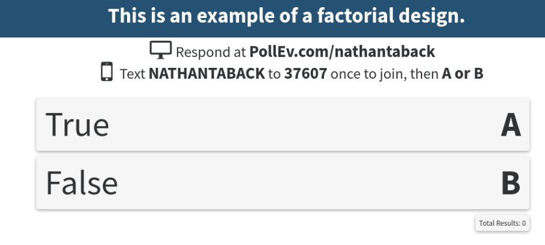

# Today's Class


- Factorial designs at two levels
- Cube plots
- Calculation of factorial effects


# Difference between ANOVA and Factorial Designs

In ANOVA the objective is to compare the individual experimental conditions with each other.
In a factorial experiment the objective is generally to compare combinations of experimental conditions.

Let's consider the food diary study above.  What is the effect of keeping a food diary?  

Expt condition | Keep food diary | Increase physical activity | Home visit |weight loss
------------------------------|----------------------|------------------------------|------------|-----------
1                             | No                   | No                           | No         |$y_1$
2                             | No                   | No                           | Yes        |$y_2$
3                             | No                   | Yes                           | No        |$y_3$
4                             | No                   | Yes                           | Yes       |$y_4$
5                             | Yes                   | No                           | No        |$y_5$
6                             | Yes                   | No                           | Yes       |$y_6$
7                             | Yes                   | Yes                           | No       |$y_7$
8                             | Yes                   | Yes                           | Yes      |$y_8$


We can estimate the effect of food diary by comparing the mean of all conditions where food diary is set to NO (conditions 1-4) and mean of all conditions where food diary set to YES (conditions 5-8).  This is also called the **main effect** of food diary, the adjective *main* being a reminder that this average is taken over the levels of the other factors.   

# Difference between ANOVA and Factorial Designs

Expt condition | Keep food diary | Increase physical activity | Home visit |weight loss
------------------------------|----------------------|------------------------------|------------|-----------
1                             | No                   | No                           | No         |$y_1$
2                             | No                   | No                           | Yes        |$y_2$
3                             | No                   | Yes                           | No        |$y_3$
4                             | No                   | Yes                           | Yes       |$y_4$
5                             | Yes                   | No                           | No        |$y_5$
6                             | Yes                   | No                           | Yes       |$y_6$
7                             | Yes                   | Yes                           | No       |$y_7$
8                             | Yes                   | Yes                           | Yes      |$y_8$


The main effect of food diary is:

$$\frac{y_1+y_2+y_3+y_4}{4}-\frac{y_5+y_6+y_7+y_8}{4}.$$

The main effect of physical activity is:

$$\frac{y_1+y_2+y_5+y_6}{4}-\frac{y_3+y_4+y_7+y_8}{4}.$$

The main effect of home visit is:

$$\frac{y_1+y_3+y_5+y_7}{4}-\frac{y_2+y_4+y_6+y_8}{4}.$$

# Question

A chemical reaction experiment was carried out with the objective of comparing if a new catalyst B would give higher yields than the old catalyst A.  The experiment was run on six different batches of raw material which were known to be quite different from one another.



# Factorial designs at two levels

To perform a factorial design:

1. Select a fixed number of levels of each factor.
2. Run experiments in all possible combinations.


# Pilot plant investigation - example of factorial design

 A pilot plant invsetiagtion employed a $2^3$ factorial design (Box, Hunter, and Hunter (2005)) with 

Factors | level 1 | level 2
--------|---------|---------
Temperature |$160 \rm {C}^{\circ}$(-1)|$180 \rm {C}^{\circ}$(+1)
Concentration| 20% (-1)| 40% (+1)
Catalyst| A (-1)|B(+1)


```{r,echo=FALSE, cache=TRUE}
tab0502 <- read.table("~/Dropbox/Docs/sta305/BHHData/BHH2-Data/tab0502.dat", header=TRUE, quote="\"")
knitr::kable(tab0502)
```

- Each data value recorded is for the response yield $y$ averaged over two duplicate runs.


# Cube plots


```{r,message=FALSE,warning=FALSE,echo=TRUE,fig.height=5,fig.width=6}
library("FrF2")
bhh54 <- lm(y~T*C*K,data=tab0502)
cubePlot(bhh54,"T","K","C",main="Cube Plot for Pilot Plant Investigation")
```


# Cube plots

```{r,message=FALSE,warning=FALSE,echo=FALSE,fig.height=5,fig.width=6}
library("FrF2")
bhh54 <- lm(y~T*C*K,data=tab0502)
cubePlot(bhh54,"T","K","C",main="")
```


# Cube plots

```{r,message=FALSE,warning=FALSE,echo=FALSE,fig.height=5,fig.width=6}
library("FrF2")
bhh54 <- lm(y~T*C*K,data=tab0502)
cubePlot(bhh54,"T","K","C",main="")
```


# Cube plots

```{r,message=FALSE,warning=FALSE,echo=FALSE,fig.height=5,fig.width=5}
library("FrF2")
bhh54 <- lm(y~T*C*K,data=tab0502)
cubePlot(bhh54,"T","K","C",main="")
```


# Cube plots

- 8 run design produces 12 comparisons 
- Each edge of cube only one factor changed while other 2 held constant.
- Therefore experimenter that believes in only changing one factor at a time is satisfied.

# Cube plots


# Interaction effects - two factor interactions

```{r,echo=FALSE, cache=TRUE}
tab0502 <- read.table("~/Dropbox/Docs/sta305/BHHData/BHH2-Data/tab0502.dat", header=TRUE, quote="\"")
knitr::kable(tab0502)
```


- When the catalyst K is A the temperature effect is: $\frac{68+72}{2}-\frac{60+54}{2}=70-57=13.$

- When the catalyst K is B the temperature effect is: $\frac{83+80}{2}-\frac{52+45}{2}=81.5-48.5=33.$

- The average difference between these two average differences is called the **interaction** between temperature and catalyst denoted by TK.  This is the interaction between the two factors temperature and catalyst - the two factor interaction between temperature and catalyst.

$$TK=\frac{33-13}{2}=10$$.


```{r,cache=TRUE,echo=FALSE,warning=FALSE}
tab0502 <- read.table("~/Dropbox/Docs/sta305/BHHData/BHH2-Data/tab0502.dat", header=TRUE, quote="\"")
#library("FrF2")
```

# Interaction plots - Concentration by temperature

```{r}
interaction.plot(tab0502$T,tab0502$C,tab0502$y, type="l",
                 xlab="Temperature",trace.label="Concentration",
                 ylab="Mean yield")
```


# Interaction plots - Temperature by catalyst

```{r}
interaction.plot(tab0502$T,tab0502$K,tab0502$y, type="l",
                 xlab="Temperature",trace.label="Catalyst",
                 ylab="Mean yield")
```


# Interaction plots - Concentration by catalyst

```{r}
interaction.plot(tab0502$K,tab0502$C,tab0502$y, type="l",
                 xlab="Catalyst",trace.label="Concentration",
                 ylab="Mean yield")
```


# Three factor interactions

```{r,echo=FALSE}
knitr::kable(tab0502)
```


The temperature by concentration interaction when the catalyst is B (at it's +1 level) is:

$$ \text {Interaction TC} = \frac{(y_8-y_7)-(y_6-y_5)}{2} =\frac{(80-45)-(83-52)}{2}=2.$$

The temperature by concentration interaction when the catalyst is A (at it's -1 level) is:

$$ \text {Interaction TC} = \frac{(y_4-y_3)-(y_2-y_1)}{2} =\frac{(68-54)-(72-60)}{2}=1.$$

$$\text{TCK}=\frac{2-1}{2}=\frac{1}{2}.$$

# Three factor interaction

- Interactions are symmetric in all factors.
- It could have been defined as half the difference between the temperature-by-catalyst interactions at each of the two concentrations.
- Mostly rely on statistical software such as R.

# Replicate runs

- Each of the 8 responses in the table is the average of two (genuinely) replicated runs.
- Genuinely replicated run means that variation between runs made at same experimental conditions is a reflection of the total run-to-run variability.
```{r,echo=FALSE}
knitr::kable(tab0502)
```

# Replicate runs
- Randomization of the run order for all 16 runs ensures the replication is genuine.
- `run1` is order of the first run and `run2` is order of the second run. 
```{r,echo=FALSE}
tab0503.1 <- read.delim("~/Dropbox/Docs/sta305/2016/classnotes/week8/tab0503-1.txt")
knitr::kable(tab0503.1)
```

# Replicate runs

- Replication not always feasible or easy.
- For the pilot plant experiment a run involved: cleaning the reactor; inserting the appropriate catalyst charge; and running the apparatus at a given concentration for 3 hours, and sampling output every 15 minutes.
- A genuine run involved taking all of these steps all over again!

# Replicate runs

- There are usually better ways to employ 16 independent runs than by fully replicating a $2^3$ factorial.
- Other designs can study four or five factors with a 16 run two-level design.

# Estimate of error variance of the effects from replicated runs

```{r,echo=FALSE}
tab0503.1 <- read.delim("~/Dropbox/Docs/sta305/2016/classnotes/week8/tab0503-1.txt")
knitr::kable(tab0503.1)
```

$$ s_i^2 = \frac{\left(y_{i1}-y_{i2}\right)^2}{2},$$

- $y_{i1}$ is the first outcome from $ith$ run.  
- $\text{diff}_i= \left(y_{i1}-y_{i2}\right)$.  
- A pooled estimate of $\sigma^2$ is 
$$s^2=\frac{\sum_{i=1}^8 s_{i}^2} {8}=\frac{64}{8}=8.$$
- The variance of an effect is:

$$Var(\text{effect})=\left(\frac{1}{8}+\frac{1}{8}\right)s^2=8/4=2$$

# Interpretation of results

- Which effects are real and which can be explained by chance?  
- A rough rule of thumb: any effect that is 2-3 times their standard error are not easily explained by chance alone.

# Interpretation of results

- Assume that the observations are independent and normally distributed then $$\text{effect}/se\left(\text{effect}\right) \sim t_8.$$

- A 95% confidence interval can be calculated as:

$$\text{effect} \pm t_{8,.05/2} \times se\left(\text{effect}\right).$$

where $t_{8,.05/2}$ is the 97.5th percentile of the $t_8$.  This is obtained in R via the `qt()` function.

```{r}
qt(p = 1-.025,df = 8)
```

- In the pilot plant study

$$\text{effect} \pm 2.3 \times 1.4 =\text{effect} \pm 3.2.$$

# Interpretation of results

- The main effect of a factor should be individually interpreted only if there is no evidence that the factor interacts with other factors.

- Which effects should be considered jointly and which independently?

Effects | 95% Confidence Interval
--------|------------------------
T       | (`r 23-3.2`, `r 23+3.2`)
C       | (`r -5-3.2`, `r -5+3.2`)
K       | (`r 1.5-3.2`, `r 1.5+3.2`)
TC      | (`r 1.5-3.2`, `r 1.5+3.2`)
TK      | (`r 10-3.2`, `r 10+3.2`)
CK      | (`r 0-3.2`, `r 0+3.2`)
TCK     | (`r 0.5-3.2`, `r 0.5+3.2`)

# Interpretation of results

- The effect of changing concentration over the ranges studied is to reduce yield by about 5 units. This is irrespective of the tested level of other variables.

- The effects of temperature and catalyst cannot be interpreted separately because of the large TK interaction. With catalyst A the temperature effect is 13 units and with catalyst B it is 33 units.

```{r,fig.height=3,fig.width=4,echo=FALSE}
interaction.plot(tab0502$T,tab0502$K,tab0502$y, type="l",
                 xlab="Temperature",trace.label="Catalyst",
                 ylab="Mean yield",cex=0.1)
```


# Linear model for factorial design

Let $y_{i}$ be the yield from the $i^{th}$ run,

$$x_{i1} =
\left\{
  \begin{array}{ll}
		+1  & \mbox{if } T=180 \\
		-1 & \mbox{if } T=160
	\end{array}
\right.$$ 

$$x_{i2} =
\left\{
  \begin{array}{ll}
    +1  & \mbox{if } C=40 \\
		-1 & \mbox{if } C=20
	\end{array}
\right.$$

$$x_{i3} =
\left\{
  \begin{array}{ll}
  	+1  & \mbox{if } K=B \\
		-1 & \mbox{if } K=A
	\end{array}
\right.$$

A linear model for a $2^3$ factorial design is:

$$y_i=\beta_0+\beta_1 x_{i1}+\beta_2 x_{i2}+\beta_3 x_{i3}+\beta_4 x_{i1}x_{i2} +\beta_5 x_{i1}x_{i3}+\beta_6 x_{i2}x_{i3} +\beta_7 x_{i1} x_{i2} x_{i3} + \epsilon_i.$$

The variables $x_{i1}x_{i2}$ is the interaction between temperature and concentration, $x_{i1}x_{i3}$ is the interaction between temperature and catalyst, etc.


# Linear model for factorial design

The table of contrasts for a $2^3$ design is the design matrix $X$ from the linear model above.

```{r,echo=FALSE}
fact.mod1 <- lm(y~T*K*C,data=tab0502)
X <- model.matrix(fact.mod1)
X <- cbind(X,tab0502$y)
colnames(X) <- list("Mean","T","K","C","T:K","T:C","K:C","T:K:C","yield average")
knitr::kable(X)
```

- All factorial effects can be calculated from  this table.
- Signs for interaction contrasts obtained by multiplying signs of their respective factors.
- Each column perfectly balanced with respect to other columns.
- Balanced (orthogonal) design ensures each estimated effect is unaffected by magnitude and signs of other effects.
- Table of signs obtained similarly for any $2^k$ factorial design.

# Linear model for factorial design

What is the table of contrasts for a $2^4$ factorial design? 

# Linear model for factorial design - calculating factorial effects from parameter estimates


The parameter estimates are obtained via the `lm()` function in R.

```{r,echo=FALSE, cache=TRUE,warning=FALSE}
tab0503 <- read.csv("~/Dropbox/Docs/sta305/BHHData/BHH2-Data/tab0503.dat", sep="")
```

- Estimated least squares coefficients are one-half the factorial estimates.  
- Therefore, the factorial estimates are twice the least squares coefficients.  

$$\begin{aligned}
{\hat \beta_1}=11.50 &\Rightarrow T=2 \times 11.50=23.26\\
{\hat \beta_2}=0.75 &\Rightarrow K=2 \times 0.75=1.5 \\
{\hat \beta_4}=5.00 &\Rightarrow TK=2 \times 5.00=10.00
\end{aligned}$$


```{r,comment=""}
fact.mod <-lm(y~T*K*C,data=tab0502)
round(summary(fact.mod)$coefficients,2)
```

# Linear model for factorial design - significance testing 

- When there are replicated runs we also obtain p-values and confidence intervals for the factorial effects from the regression model. 
- For example, the p-value for $\beta_1$ corresponds to the factorial effect for temperature

$$H_0: \beta_1=0 {\hspace{0.2cm}} \text{vs.} {\hspace{0.2cm}} H_1:\beta_1 \ne 0.$$

If the null hypothesis is true then $\beta_1=0 \Rightarrow T=0 \Rightarrow \mu_{T+}-\mu_{T-}=0 \Rightarrow \mu_{T+}=\mu_{T-}.$

- $\mu_{T+}$ is the mean yield when the temperature is set at $180^{\circ}$ and $\mu_{T-}$ is the mean yield when the temperature is set to $160^{\circ}.$  

# Linear model for factorial design - significance testing 


To obtain 95% confidence intervals for the factorial effects we multiply the 95% confidence intervals for the regression parameters by 2.  This is easily done in R using the function `confint.lm()`.

```{r,comment=""}
fact.mod <-lm(y~T*K*C,data=tab0503)
round(2*confint.lm(fact.mod),2)
```

# Advantages of factorial designs over one-factor-at-a-time designs

- Suppose that one factor at a time was investigated.  For example, temperature is investigated while holding concentration at 20% (-1) and catalyst at B (+1).
- In order for the effect to have more general relevance it would be necessary for the effect to be the same at all the other levels of concentration and catalyst.  
- In other words there is no interaction between factors (e.g., temperature and catalyst).  
- If the effect is the same then a factorial design is more efficient since the estimates of the effects require fewer observations to achieve the same precision.  
- If the effect is different at other levels of concentration and catalyst then the factorial can detect and estimate interactions. 


